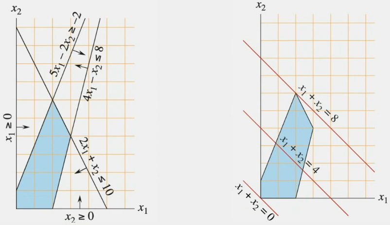

# Programación Lineal

## Índice

- [Componentes de Programación Lineal](#componentes-de-programación-lineal)
- [Ejemplo 0](#ejemplo-0)
- [Ejemplo 1](#ejemplo-1)
- [Ejemplo 2](#ejemplo-2)
- [Programación Lineal Entera](#programación-lineal-entera)
- [Ejemplo con variables binarias](#ejemplo-con-variables-binarias)
- [Problema de la mochila](#problema-de-la-mochila)
- [Coloreo en Grafos](#coloreo-en-grafos)
- [Independent Set](#independent-set)
- [Problema del Cambio](#problema-del-cambio)
- [Problema del Viajante](#problema-del-viajante)
- [Algoritmos internos que resuelven problemas de Programación Lineal](#algoritmos-internos-que-resuelven-problemas-de-programación-lineal)
    - [Método Simplex](#método-simplex)
    - [Branch and Bound](#branch-and-bound)

Programación Lineal es una técnica de diseño que permite resolver problemas de optimización de un sistema de ecuaciones/inecuaciones lineal en varias variables. Por ejemplo:

$cte_0 \cdot x_0 + cte_1 \cdot x_1 + cte_2 \cdot x_2 + \ldots + cte_n \cdot x_n >= cte$

Lo que se busca es maximizar o minimizar una función objetivo en particular, donde ésta es una combinación **lineal** de las variables. Es decir, no pueden haber productos de variables, ni potencias, ni funciones trigonométricas, etc.

Esta técnica es principalmente empleada en investigación operativa para maximizar ganancias o minimizar costos (y determinar márgenes de mejora, etc..).

## Componentes de Programación Lineal

1. Variables (primero veremos las continuas, pero pueden ser de otro tipo)
2. Ecuaciones/Inecuaciones lineales que definen restricciones sobre dichas variables:
$$\sum_{i=1}^{n} a_i x_i \geq b$$
3. Función objetivo a optimizar:
$$\max \sum_{i=1}^{n} c_i x_i$$
4. Aplicación de un algoritmo que resuelva el modelo lineal (Simplex, etc.)

Las restricciones van a crear un dominio de soluciones posibles, que puede ser también vacío.

## Ejemplo 0

La idea es modelar algún problema de la vida real en un sistema de ecuaciones lineales, pero primero veamos un ejemplo de cómo se resuelve un sistema de ecuaciones lineales:
$4x_1 - x_2 <= 8$
$2x_1 + x_2 <= 10$
$5x_1 - 2x_2 >= -2$
$x_1, x_2 >= 0$

Queremos maximizar la función objetivo:
$x_1 + x_2$

Podemos representar gráficamente la solución de este sistema de ecuaciones de la siguiente manera:


En problemas lineales continuos la solución óptima siempre va a estar en algún vértice del polígono que se forma con las intersecciones de las restricciones. Esto es fácil verlo en la gráfica anterior.

## Ejemplo 1

Tenemos una empresa TeoAlgoSoft que vende 2 comestibles por kilo: $c_1$ y $c_2$. Por cuestiones normativas de Martinlandia:

- No podemos vender $c_2$ más del triple de $c_1$.
- La cantidad de $c_1$ sumado al doble de la cantidad de $c_2$ no puede superar los 14 kilos.
- La cantidad de kilos que exceda $c_1$ a $c_2$ no puede superar los 2 kilos.

La ganancia del día puede verse por $5/kilo del producto $c_1$ y $3/kilo del producto $c_2$. ¿Cuántos kilos de cada producto debería vender TeoAlgoSoft para maximizar su ganancia?

Modelemos el problema en un sistema de ecuaciones lineales. Definiendo $x$ como la cantidad de kilos de $c_1$ y $y$ como la cantidad de kilos de $c_2$:

La primera restricción: $y <= 3x$

La segunda restricción: $x + 2y <= 14$

La tercera restricción: $x - y <= 2$

Buscamos maximizar la función objetivo: $5x + 3y$

Grafiquemos el área:


Utilizaremos la librería `pulp` para resolver este problema:

```python
import pulp

def ejemplo1():
    x = pulp.LpVariable('x', lowBound=0, cat='Continuous')
    y = pulp.LpVariable('y', lowBound=0, cat='Continuous')

    problema = pulp.LpProblem("Ejemplo 1", pulp.LpMaximize)

    problema += y <= 3*x
    problema += x + 2*y <= 14
    problema += x - y <= 2

    problema += 5*x + 3*y
    problema.solve()

    return pulp.value(x), pulp.value(y)

print(ejemplo1())
```

El código anterior imprime `(6.0, 4.0)`, lo que significa que TeoAlgoSoft debería vender 6 kilos de $c_1$ y 4 kilos de $c_2$ para maximizar su ganancia.

### ¿Qué pasa si el dominio no está acotado?

Si sacamos la restricción $x + 2y <= 14$, el dominio de soluciones posibles se extiende a infinito. Al no tener un dominio de soluciones acotado, la librería `pulp` nos devolverá el mejor vértice que maximice la función objetivo por cómo está implementado. Lo que, no necesariamente es la solución óptima. Por esto es importante asegurarnos de que el dominio de soluciones sea acotado.

## Ejemplo 2

Nuestra empresa de cereales tiene que cumplir con un pedido de al menos 100 kilos del producto estrella de la empresa para el fin de semana. Para elaborar el producto se necesita la misma cantidad de amaranto y frutos secos(1 kilo de amaranto y 1 kilo de frutos secos forman 2 kilos del producto), y contamos con 2 proveedores de los mismos:
- Valle Patagua: nos vende a $1/kilo el amaranto, como máximo 40 kilos.
- Salud Sustentable: nos vende cajas de 2 kilos de amaranto y 5 kilos de frutos secos por $6, como máximo 30 cajas. Supongamos que podemos pedir fracciones de cajas.

Queremos minimizar los costos de producción.

Definimos $VP$ como la cantidad de kilos de amaranto que compramos a Valle Patagua y $SS$ como la cantidad de cajas que compramos a Salud Sustentable.

Empecemos por lo más fácil de modelar, las cantidades máximas:

$VP <= 40$

$SS <= 30$

Luego la cantidad de kilos de amaranto y frutos secos que necesitamos para cumplir con el pedido. Necesitamos al menos 50 kilos de amaranto y 50 kilos de frutos secos:

$VP + 2SS >= 50$

$5SS >= 50$

Finalmente, la función objetivo a minimizar:

$VP + 6SS$

```python
def ejemplo2():
    VP = pulp.LpVariable('VP', lowBound=0, cat='Continuous')
    SS = pulp.LpVariable('SS', lowBound=0, cat='Continuous')

    problema = pulp.LpProblem("Ejemplo 2", pulp.LpMinimize)

    problema += VP <= 40
    problema += SS <= 30
    problema += VP + 2*SS >= 50
    problema += 5*SS >= 50

    problema += VP + 6*SS
    problema.solve()

    return pulp.value(VP), pulp.value(SS)

print(ejemplo2())
```

El código anterior imprime `(30.0, 10.0)`, lo que significa que la empresa debería comprar 30 kilos de amaranto a Valle Patagua y 10 cajas a Salud Sustentable para minimizar los costos de producción.

## Programación Lineal Entera

En algunos casos, las variables sólo pueden tomar valores enteros. Al indicar esto en la definición de la variable, el resultado puede cambiar drásticamente, debemos incluso utilizar otro algoritmo para resolver el problema.

Volvamos al ejemplo 2. Comprar fracciones de cajas no tiene sentido, asique vamos a modificar el problema para que las variables sean enteras:

```python
def ejemplo2_entero():
    VP = pulp.LpVariable('VP', lowBound=0)
    SS = pulp.LpVariable('SS', lowBound=0, cat='Integer')

    problema = pulp.LpProblem("Ejemplo 2", pulp.LpMinimize)

    problema += VP <= 40
    problema += SS <= 30
    problema += VP + 2*SS >= 50
    problema += 5*SS >= 50

    problema += VP + 6*SS
    problema.solve()

    return pulp.value(VP), pulp.value(SS)

print(ejemplo2_entero())
```

Como la solución óptima ya era entera, el resultado no cambia en este caso. Se sugiere al lector probar con otros valores para ver cómo cambia la solución al indicar que las variables son enteras.

## Ejemplo con variables binarias

También podemos definir variables booleanas/binarias para definir problemas de decisión.

Tenemos que decidir si lanzamos diferentes productos (tenemos 6), se deben lanzar al menos 3. Cada producto tiene un determinado costo y tenemos un presupuesto.

Podemos definir una variable $y_i$ que sea 1 si lanzamos el producto $i$ y 0 si no lo lanzamos. Entonces la restricción de lanzar al menos 3 productos se puede modelar como:

$\sum_{i=1}^{6} y_i >= 3$

Si queremos minimizar los costos, la función objetivo sería:

$\sum_{i=1}^{6} c_i y_i$

Donde $c_i$ es el costo de lanzar el producto $i$.

### Nuevas restricciones

Si lanzamos el producto 5 o 6, debemos lanzar el 1 si o si. ¿Cómo modelamos esto?

Si lanzamos el producto 5, entonces lanzamos el 1. Entonces, $y_1$ debe ser al menos igual a $y_5$, ya que si $y_5$ es 0, $y_1$ puede ser 0 o 1. Si $y_5$ es 1, $y_1$ debe ser 1. Esto aplica también para el producto 6:

$y_1 >= y_5$

$y_1 >= y_6$

Si se lanzan juntos los productos 3 y 4, se ahorran $100. ¿Cómo modelamos esto?

Esto va a influir en la función objetivo, el costo de lanzar los productos. Entonces, podemos restar 100 al costo de lanzar los productos 3 y 4 si ambos son lanzados.

Si alguna vez cursaron materias en donde se ven lógicas booleanas, sabrán que esta condición AND se puede modelar como una multiplicación. Sin embargo, necesitamos mantener las ecuaciones **lineales**. 

Lo que podemos hacer es definir una nueva variable $z$ que sea 1 si lanzamos los productos 3 y 4 juntos, y 0 si no. Similar a lo que hicimos en la restricción anterior, podemos modelar esto como:

$y_3 >= z$

$y_4 >= z$

Esto es equivalente a:

$y_3 + y_4 >= 2z$

Ahora para modelar "si $y_3$ y $y_4$ son 1, entonces $z$ es 1", podemos hacer:

$1 + z >= y_3 + y_4$

## Problema de la mochila

Tenemos un conjunto de elementos a guardar en una mochila, cada uno con un valor $v_i$ y un volumen $w_i$. La mochila tiene un volumen máximo $W$. Queremos maximizar el valor total de los elementos que guardamos en la mochila.

Podemos definir una variable $y_i$ que sea 1 si guardamos el elemento $i$ en la mochila y 0 si no:

$\sum_{i=1}^{n} w_i y_i <= W$

Luego, la función objetivo a maximizar sería:

$\sum_{i=1}^{n} v_i y_i$

```python
def mochila():
    elementos = [
        (10, 60),
        (20, 100),
        (30, 120)
    ]

    W = 30

    y = [pulp.LpVariable(f'y{i}', lowBound=0, cat='Binary') for i in range(len(elementos))]

    problema = pulp.LpProblem("Mochila", pulp.LpMaximize)

    problema += pulp.lpSum([elementos[i][0] * y[i] for i in range(len(elementos))]) <= W
    problema += pulp.lpSum([elementos[i][1] * y[i] for i in range(len(elementos))])

    problema.solve()

    return [pulp.value(y[i]) for i in range(len(elementos))]

print(mochila())
```

## Coloreo en Grafos

Dado un grafo, queremos colorear los nodos de tal manera que nodos adyacentes no tengan el mismo color. ¿Cómo modelamos esto?

Podemos empezar definiendo una variable $X_{i,c}$ que sea 1 si el nodo $i$ tiene el color $c$ y 0 si no, para cada nodo y color. Luego, para asegurar que un nodo tenga un color y uno solo:

$\sum_{c=1}^{n} X_{i,c} = 1$

Para asegurar que nodos adyacentes no tengan el mismo color, podemos hacer:

$X_{i,c} + X_{j,c} <= 1$ para cada arista $(i, j)$, para cada color $c$.


## Independent Set

Dado un grafo, queremos encontrar el conjunto independiente más grande. Un conjunto independiente es un conjunto de nodos tal que no hay aristas entre ellos.

Podemos definir una variable $Y_i$ que sea 1 si el nodo $i$ está en el conjunto independiente y 0 si no. Luego, para asegurar que no haya aristas entre nodos en el conjunto independiente:

$Y_i + Y_j <= 1$ para cada arista $(i, j)$.

La función objetivo a maximizar sería:

$\sum_{i=1}^{n} Y_i$

### Approach por vértices adyacentes

¿Qué pasa si definimos la siguiente restricción en lugar de la planteada anteriormente?:

$Y_i + \sum_{j \in adyacentes(i)} Y_j <= 1$

Este enfoque tiene un problema. Pensemos en un grafo con un nodo central, y muchos nodos adyacentes a este, no conectados entre sí. En este caso el conjunto independiente más grande sería el conjunto de todos los nodos adyacentes al nodo central. Sin embargo, con la restricción anterior esto sería inválido, ya que al usar el nodo central como $Y_i$, la suma de los nodos adyacentes sería mayor a 1.

Una técnica para manejar esta situación es anular la restricción en caso de que $Y_i$ sea 0, ya que si fuese 1, todos sus adyacentes sí tendrían que ser 0 y la sumatoria debería dar 1 junto a $Y_i$. La técnica se llama "Big-M" y consiste en lo siguiente:

$Y_i + \sum_{j \in adyacentes(i)} Y_j <= 1 + M(1 - Y_i)$

Si $M$ es un número lo suficientemente grande, la inecuación siempre se va a cumplir si Y_i es 0, pudiéndonos deshacer de la restricción en ese caso.

El valor exacto que podemos asignarle a $M$ es la cantidad de vértices en el grafo, ya que el independent set más grande posible es de tamaño $n$.

## Problema del Cambio

Dado un conjunto de monedas de diferentes valores, queremos dar un cambio de un valor $V$ con la menor cantidad de monedas posibles.

Podemos definir una variable $M_i$ que sea la cantidad de monedas de valor $v_i$ que damos de cambio. La restricción sería:

$\sum_{i=1}^{n} v_i M_i = V$

La función objetivo a minimizar, la cantidad de monedas que damos de cambio:

$\sum_{i=1}^{n} M_i$

## Problema del Viajante

Dado un conjunto de ciudades y las distancias entre ellas, queremos encontrar el camino más corto que pase por todas las ciudades exactamente una vez y vuelva a la ciudad de origen.

Una forma de modelar este problema es lo siguiente:

1. Para toda par de ciudades que no estén conectadas entre sí, agregamos una arista con un valor "infinito" (sumatoria de todas las distancias + 1).
2. Definimos variables $X_{i,j}$ que sean 1 si usamos la arista $(i, j)$ en el camino y 0 si no.
3. Definimos restricciones para asegurar que salimos y entramos a cada ciudad exactamente una vez:
    - $\sum_{j=1}^{n} X_{i,j} = 1$ para cada ciudad $i$
    - $\sum_{i=1}^{n} X_{i,j} = 1$ para cada ciudad $j$
4. La función objetivo a minimizar, la suma de las distancias de las aristas usadas:
    - $\sum_{i=1}^{n} \sum_{j=1}^{n} d_{i,j} X_{i,j}$

Estos pasos parecen ser suficientes, pero no lo son. ¿Por qué? Porque no estamos asegurando que las aristas elegidas formen un camino y uno sólo. Por ejemplo, dado un grafo con todos los nodos conectados entre sí, podría definir como solución óptima dos ciclos separados, uno con la mitad de las ciudades y otro con la otra mitad.

Para que las aristas formen efectivamente un camino, podemos definir la siguiente restricción:

$p_i - p_j + n X_{i,j} <= n - 1$ para cada arista $(i, j)$

Donde $p_i$ es la posición de la ciudad $i$ en el recorrido. Si $X_{i,j}$ es 0, la inecuación siempre se cumple, por lo que es irrelevante. Si $X_{i,j}$ es 1, entonces $p_i - p_j$ debe ser -1 para que la inecuación se cumpla, es decir, $p_j = p_i+1$ ;lo que significa que se visita la ciudad $j$ inmediatamente después de la ciudad $i$.

## Algoritmos internos que resuelven problemas de Programación Lineal

Los algoritmos internos que resuelven problemas de PL son muy complejos y no es necesario entenderlos en detalle para poder utilizarlos, tampoco se van a tomar. Sin embargo, se los detalla para que el lector tenga una idea de cómo funcionan.

## Método Simplex

El método Simplex es un algoritmo iterativo que se basa en que en un problema lineal, los óptimos van a estar siempre en los vértices del polígono que se forma con las restricciones; aunque en el caso de tener variables enteras no siempre es posible usarlos, y se tendrá que hacer el ajuste. El algoritmo es en sí greedy, busca óptimos locales esperando que sean el óptimo general también.

Su complejidad es en un principio de $O(2^n)$, pero para problemas lineales continuos se demostró que es de $O(n^9)$.

### Ejemplo

Dado el siguiente problema:

$X_1 + X_2 <= 5$

$X_1 + 4X_2 <= 10$

Con función objetivo a maximizar:

$\frac{1}{2}X_1 + X_2$

El dominio de soluciones posibles es el siguiente:


El primer paso es convertir las inecuaciones en ecuaciones, agregando variables de Slack:

$X_1 + X_2 + S_1 = 5$

$X_1 + 4X_2 + S_2 = 10$

Esto se debe a que trabajar con ecuaciones es más sencillo que con inecuaciones a la hora de ir pasando variables de una ecuación a otra.

Lo que se hace es ir despejando variables para ir obteniendo los vértices, paso a paso, muy similarmente a lo que se hicimos en la materia álgebra.

### Ejemplo más completo

Dado el siguiente problema:

$2X_1 + 2X_2 <= 600$

$4X_2 <= 600$

$2X_1 + 4X_2 <= 800$

Con función objetivo a maximizar:

$8X_1 + 10X_2$

Los convertimos en ecuaciones:

$2X_1 + 2X_2 + S_1 = 600$

$4X_2 + S_2 = 600$

$2X_1 + 4X_2 + S_3 = 800$

La función objetivo la pasamos a una ecuación:

$Z_{max} = 8X_1 + 10X_2$

*Las variables de Slack $S_1, S_2, S_3$ son positivos ya que son "lo que falta" para que se cumpla la inecuación.

Ahora pasamos las expresiones algebraicas a una expresión matricial:

$$
X = \begin{bmatrix} X_1 \\ X_2 \\ S_1 \\ S_2 \\ S_3 \end{bmatrix}
A = \begin{bmatrix} 2 & 2 & 1 & 0 & 0 \\ 0 & 4 & 0 & 1 & 0 \\ 2 & 4 & 0 & 0 & 1 \end{bmatrix} 
B = \begin{bmatrix} 600 \\ 600 \\ 800 \end{bmatrix} 
C = \begin{bmatrix} 8 \\ 10 \\ 0 \\ 0 \\ 0 \end{bmatrix}
$$

Donde X es el vector de variables,  A es la matriz de coeficientes de las variables, B es el vector de términos independientes, C es el vector de coeficientes de la función objetivo.

Nuestra tabla del método simplex quedaría de la siguiente manera:

$$ \begin{bmatrix}
C_k & X_k & A_1 & A_2 & A_3 & A_4 & A_5 & B_k \\ 
0 & S_1 & 2 & 2 & 1 & 0 & 0 & 600  \\ 
0 & S_2 & 0 & 4 & 0 & 1 & 0 & 600  \\ 
0 & S_3 & 2 & 4 & 0 & 0 & 1 & 800  
\end{bmatrix} $$

Definiremos $Z$ como el valor actual de la función objetivo basado en las variables que tenemos en la tabla. Su fórmula es: $Z = \sum_{i=1}^{n} C_i A_{fila_i}$.

Como las coeficientes son 0, inicialmente:

$$ Z = \begin{bmatrix} 0 & 0 & 0 & 0 & 0 \end{bmatrix} $$

$$ Z - C = \begin{bmatrix} -8 & -10 & 0 & 0 & 0 \end{bmatrix} $$

Esto último nos indica que debemos seguir iterando: si algún valor es positivo, indica que debemos sacar la variable correspondiente de la tabla y si es negativo, debemos incorporarla. En este caso, al incorporar $X_1$ y $X_2$ a la tabla, la situación mejora.

Primero incorporamos a $X_1$ a la tabla. La variable que vamos a reemplazar es la que tenga menor valor $\frac{B_k}{A_{1}}$. En este caso, para $S_1$ es $\frac{600}{2} = 300$, para $S_2$ es $\frac{600}{0} = undefined$ y para $S_3$ es $\frac{800}{2} = 400$. La variable que vamos a reemplazar es $S_1$.

$$ \begin{bmatrix}
C_k & X_k & A_1 & A_2 & A_3 & A_4 & A_5 & B_k \\
8 & X_1 & 1 & 1 & \frac{1}{2} & 0 & 0 & 300  \\
0 & S_2 & 0 & 4 & 0 & 1 & 0 & 600  \\
0 & S_3 & 0 & 2 & -1 & 0 & 1 & 200
\end{bmatrix} $$

Lo que se hizo fue básicamente triangular de forma que tengamos $A_1 = 1$ en la primera fila y 0 en el resto.
- Dividir la fila 1 por 2
- Multiplicar la fila 1 por 2 y restarla a la fila 3

Ahora calculamos $Z = \sum_{i=1}^{n} C_i A_{fila_i}$:

$$ Z = \begin{bmatrix} 8 & 8 & 4 & 0 & 0 \end{bmatrix} $$

$$ Z - C = \begin{bmatrix} 0 & -2 & 4 & 0 & 0 \end{bmatrix} $$

Lo que indica que debemos incorporar $X_2$ a la tabla. 

La variable que vamos a reemplazar es la que tenga menor valor $\frac{B_k}{A_{2}}$. En este caso, para $S_2$ es $\frac{600}{4} = 150$ y para $S_3$ es $\frac{200}{2} = 100$. La variable que vamos a reemplazar es $S_3$.

$$ \begin{bmatrix}
C_k & X_k & A_1 & A_2 & A_3 & A_4 & A_5 & B_k \\
8 & X_1 & 1 & 0 & 1 & 0 & -\frac{1}{2} & 200  \\
0 & S_2 & 0 & 0 & 2 & 1 & -2 & 400  \\
10 & X_2 & 0 & 1 & -\frac{1}{2} & 0 & \frac{1}{2} & 100  
\end{bmatrix} $$

$$ Z = \begin{bmatrix} 8 & 10 & 3 & 0 & 1 \end{bmatrix} $$

$$ Z - C = \begin{bmatrix} 0 & 0 & 3 & 0 & 1 \end{bmatrix} $$

Como los valores positivos de $Z - C$ corresponden a las variables $S_1$ y $S_3$ que ya no están en la tabla, hemos llegado al óptimo. La solución es $X_1 = 200, X_2 = 100$.

Si reemplazamos los valores en la función objetivo: $8*200 + 10*100 = 2600$.

### ¿Cómo resolvemos cuando el vector nulo no es solución?

Cuando el vector nulo no es solución, no podemos empezar con la tabla de la forma que lo hicimos anteriormente ya que la idea es ir iterando con soluciones válidas.

Por ejemplo, si tenemos el siguiente problema:

$X_1 >= 2$

Primero, pasamos la inecuación a la siguiente ecuación:

$X_1 - S_1 = 2$

Luego, creamos una variable artificial $\mu$.

$X_1 - S_1 + \mu = 2$

Para asegurarnos que la variable artificial termine valiendo 0, le ponemos un coeficiente muy grande y contrario a lo que queremos lograr en la función objetivo. Por ejemplo, si queremos maximizar la función objetivo, le ponemos un coeficiente muy grande y negativo, si queremos minimizar, positivo. El valor del coeficiente es arbitrario, pero mientras más grande, más rápido el algoritmo va a converger.

$Z_{max} = X_1 - M \mu$

Entonces, el algoritmo va a determinar que $\mu$ debe ser 0.

### Otro caso de variables artificiales

Si tenemos el siguiente problema:

$X_1 + X_2 = 10$

No podemos tener una tabla con el vector nulo, ya que no es solución (0 + 0 != 10).

Podríamos cambiarlo por dos inecuaciones:

$X_1 + X_2 <= 10$

$X_1 + X_2 >= 10$

Pero si quisiéramos hacer esto, tendríamos que agregar una variable slack para cada inecuación luego al convertirlos en ecuaciones. Entonces, lo que podemos hacer es agregar una variable artificial $\mu$ directamente en la ecuación:

$X_1 + X_2 + \mu = 10$

### Otras consideraciones

Si nuestro dominio (poliedro) es abierto y la solución está en el infinito, el método simplex puede no converger, o a partir de alguna iteración tener todos los valores de $Z - C$ negativos, lo que indica que cualquier variable debe ser incorporada, pero ninguna debe ser reemplazada. En este caso, no hay solución definida.

## Branch and Bound

Branch and Bound es esencialmente un algoritmo de backtracking, donde se aplica branching para ver diferentes alternativas, con bounds como podas. Los pasos son los siguientes:

1. Buscamos una solución inicial, por ejemplo, con el método simplex.
2. Sobre la solución inicial, para variables enteras, ramificamos en dos ramas: en una rama agregamos la restricción $X \leq X_{abajo}$, en la otra $X \geq X_{arriba} + 1$.
3. Resolvemos cada rama, y si la solución es entera, la guardamos. Si no, seguimos ramificando.

### Ejemplo

Dado el siguiente problema:

$2X_1 + X_2 <= 6$

$2X_1 + 3X_2 <= 9$

Con función objetivo a maximizar:

$3X_1 + 4X_2$

Con $X_1, X_2 >= 0$ y enteros.

La solución inicial relajada la calculamos con el método simplex: $X_1 = \frac{9}{4}, X_2 = \frac{3}{2}$.


