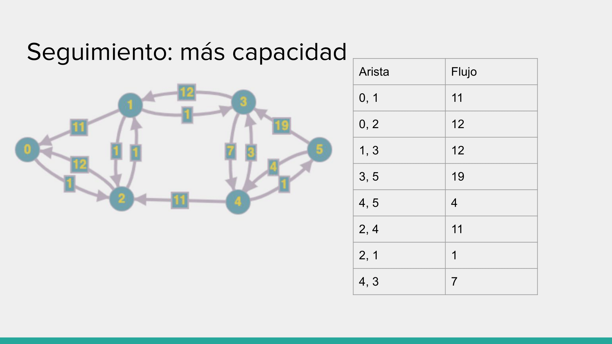
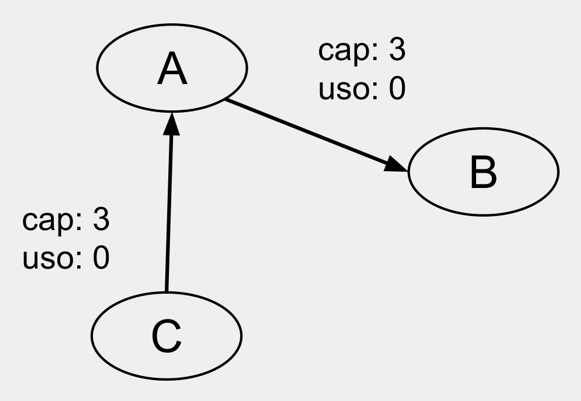

# Redes de Flujo

## Índice

- [Redes de flujo](#redes-de-flujo)
- [Red Residual](#red-residual)
- [Camino de aumento (augmenting path)](#camino-de-aumento-augmenting-path)
- [Algoritmo de Ford-Fulkerson](#algoritmo-de-ford-fulkerson)
- [¿Cuál es la mejor forma de obtener un camino?](#cuál-es-la-mejor-forma-de-obtener-un-camino)
  - [Seguimiento](#seguimiento)
- [Corte Mínimo](#corte-mínimo)
- [¿Cómo obtenemos el corte mínimo?](#cómo-obtenemos-el-corte-mínimo)
- [Integer Flow Theorem](#integer-flow-theorem)
- [Quiz](#quiz) 
- [Otro seguimiento de Ford-Fulkerson](#otro-seguimiento-de-ford-fulkerson)
- [Aplicaciones de redes de flujo](#aplicaciones-de-redes-de-flujo)
  - [Perfect Bipartite Matching](#perfect-bipartite-matching)
  - [Disjoint Paths](#disjoint-paths)
  - [Disjoint Paths en grafos no dirigidos](#disjoint-paths-en-grafos-no-dirigidos)
  - [Circulaciones con demandas](#circulaciones-con-demandas)
  - [Circulaciones con demandas y cotas mínimas](#circulaciones-con-demandas-y-cotas-mínimas)
  - [Ejemplo: Diseño de encuestas](#ejemplo-diseño-de-encuestas)
  - [Ejemplo: Airlines Scheduling](#ejemplo-airlines-scheduling)
  - [Ejemplo: Project Selection](#ejemplo-project-selection)

Es posible modelar los flujos de materiales (por ej. cloacas, información en redes, etc.) mediante grafos. Éstos se llaman **redes de flujo**, cuyas características incluye:

- El grafo es dirigido.
- Existe un único nodo fuente (source) y un único nodo sumidero (sink). Esto implica que existe una única componente débilmente conexa. La fuente es un vértice con grado de entrada 0 y el sumidero es un vértice con grado de salida 0.
- Cada vértice intermedio simplemente traslada lo que recibe a otro vértice. No produce ni consume.
- Cada arista tiene un peso que indica la capacidad de flujo que puede pasar por ella.


Nuestro objetivo es obtener el flujo máximo que puede pasar por la red, es decir, la cantidad máxima de flujo que puede pasar desde la fuente al sumidero.

	


### Restricciones

- No se admiten aristas autorreferentes (bucles).
- No pueden haber ciclos de dos vértices (aristas antiparalelas).
- Solo debe haber una fuente.
- Solo debe haber un sumidero.

En el caso de tener un grafo que no cumple con estas restricciones, se puede transformarlo para que las cumpla.

- Si hay una arista autorreferente, la podemos sacar ya que no aporta nada al flujo.
- Si hay ciclos de dos vértices, podemos agregar un vértice intermedio y dividir una arista en dos, convirtiéndolo en un ciclo de tres vértices.


- Si hay más de una fuente, podemos agregar un nodo fuente y conectarlo con las fuentes originales mediante aristas de capacidad infinita.


- Si hay más de un sumidero, podemos agregar un nodo sumidero y conectarlo con los sumideros originales mediante aristas de capacidad infinita.


## Red Residual

La red residual es una red que se obtiene a partir de una red de flujo. Tiene los mismos vértices, pero tiene como aristas:

- Las mismas del grafo original, al que aún les quede capacidad por utilizar. Su peso es la capacidad restante.
- Las aristas opuestas a las del grafo original, cuyo peso es el flujo que pasa por la arista original.
- Si alguno de los anteriores tendrían peso 0, no se agregan.

En el peor de los casos el grafo residual tiene el doble de aristas que el grafo original.

Un grafo residual es una red de flujo también, salvo que tiene aristas antiparalelas.

## Camino de aumento (augmenting path)

Si encontramos un camino de la fuente al sumidero en el grafo residual, significa que podemos aumentar el flujo en la red original. Pueden pensar que como tenemos aristas por donde podrían pasar más flujo, si existe un camino a través de ellas para llegar al sumidero, podemos usarlo para aumentar el flujo por allí.

## Algoritmo de Ford-Fulkerson

El algoritmo de Ford-Fulkerson propone el siguiente esquema para encontrar el flujo máximo en una red de flujo:

```python
def flujo(grafo, s, t):
    inicializamos el flujo por toda arista a 0
    mientras haya un camino en la red residual:
        aumentamos el flujo por el camino
    devolvemos el flujo total
```

## ¿Cuál es la mejor forma de obtener un camino?

Dependiendo de cómo obtengamos el camino, el algoritmo puede o no converger. La Implementación de Edmonds-Karp que utiliza BFS para obtener el camino está comprobada que converge con complejidad O(V * E^2).

### Seguimiento

Teniendo una red de flujo como la siguiente:


Por ahora no calculamos ningún flujo, por lo que la red residual es igual a la red original estableciendo flujo 0 en todas las aristas.

1. Buscamos un camino de aumento. En este caso, el camino es 0 -> 1 -> 3 -> 5.


Aumentamos el flujo por el camino. La capacidad máxima que podemos aumentar por este camino es 11. Vamos a crear las aristas opuestas con el flujo que aumentamos, y restar la capacidad de las aristas originales.


2. Iteramos nuevamente. En este caso, el camino es 0 -> 2 -> 4 -> 5.


3. Iteramos nuevamente. En este caso, el camino es 0 -> 2 -> 4 -> 3 -> 5.


4. Iteramos nuevamente. En este caso, el camino es 0 -> 2 -> 1 -> 3 -> 5.


5. Iteramos nuevamente. Ya no hay más caminos de aumento.

### ¿Qué pasa si aumentamos la capacidad de una arista?

Supongamos que tenemos una red residual que representa un sistema de cañerías. Reforzamos una cañería, aumentando su capacidad. ¿Puedo reutilizar la red residual ya calculada? La respuesta es sí, y daremos seguimiento a un escenario posible, que incluye un caso particular de "camino encontrado".

Supongamos que aumentamos las capacidades de las aristas (0, 2), (1, 3), (4, 5) en 1:



Seguimos los pasos de la iteración. El camino encontrado es 0 -> 2 -> 1 -> 3 -> 4 -> 5.

Acá tenemos un caso particular. En la tabla de flujos, no existe la arista (3, 4) ya que la tabla guarda las aristas de la red de flujo original y los flujos que pasan por ellas. La arista (3, 4) es una arista opuesta generada al haber sido utilizada la arista (4, 3).


Lo que debemos hacer es restarle 1 a la capacidad de la arista (4, 3) en la tabla de flujos. Esto significa que el vértice 4 le pasará menos flujo al vértice 3, ya que ahora al vértice 3 le llegará ese flujo desde el vértice 1 y el vértice 3 no puede tomar más flujo de lo que ya toma. Y ese flujo que el vértice 4 dejó de pasarle, ahora lo pasará por la arista reforzada (4, 5).


## Implementación

```python
def flujo(grafo, s, t):
    flujo = {}
    for v in grafo:
        for w in grafo.adyacentes():
            flujo[(v, w)] = 0
    grafo_residual = grafo.copy()
    while (camino = obtener_camino(grafo_residual, s, t)) is not None:
        capacidad_residual_camino = min_peso(grafo_residual, camino)
        for i in range(1, len(camino)):
            if grafo.hay_arista(camino[i-1], camino[i]):
                flujo[(camino[i-1], camino[i])] += capacidad_residual_camino
            else:
                flujo[(camino[i], camino[i-1])] -= capacidad_residual_camino
            actualizar_grafo_residual(grafo_residual, camino[i-1], camino[i], capacidad_residual_camino)
    return flujo

def actualizar_grafo_residual(grafo_residual, u, v, capacidad_residual):
    peso_anterior = grafo_residual_residual.peso(u, v)
    if peso_anterior == capacidad_residual:
        grafo_residual.eliminar_arista(u, v)
    else:
        grafo_residual.modificar_peso(u, v, peso_anterior - capacidad_residual)
    if not grafo_residual.hay_arista(v, u):
        grafo_residual.agregar_arista(v, u, capacidad_residual)
    else:
        grafo_residual.modificar_peso(v, u, grafo_residual.peso(v, u) + capacidad_residual)
```

## Corte Mínimo

Un corte mínimo de una red es el peso total mínimo que necesitamos desconectar para que un grafo deje de estar conectado, separando los vértices en dos conjuntos dijuntos (conexo para grafos no dirigidos y débilmente conexo para grafos dirigidos). Si el grafo es no pesado, corresponde a la cantidad de aristas que necesitamos desconectar (equivalente a asignar peso 1 a todas las aristas).

Este concepto existe en cualquier tipo de grafo, pero en el caso de redes de flujo tiene una interpretación particular: el teorema max flow - min cut nos dice que el flujo máximo que puede pasar por una red es igual al peso del corte mínimo que separe la fuente del sumidero.

## ¿Cómo obtenemos el corte mínimo?

1. Corremos el algoritmo de Ford-Fulkerson para obtener el grafo residual.
2. Recorremos todos los vértices a los que podemos llegar desde la fuente en el grafo residual. Llamamos a ese conjunto de vértices S, y al resto de los vértices T.
3. Todas las aristas del grafo original que vayan de un vértice de S a uno de T forman el corte mínimo.

De esta forma, podemos obtener el corte mínimo que separa la red en dos conjuntos disjuntos débilmente conexos.

Volviendo a nuestro ejemplo:

Red original:


Red residual:


S = {0}

T = {1, 2, 3, 4, 5}

Corte mínimo = {(0, 1), (0, 2)}

## Integer Flow Theorem

Si la red de transporte sólo tiene aristas con capacidades enteras, entonces existe un flujo máximo en el que la capacidad utilizada de cada arista es un número entero.

## Quiz

Dados los siguientes grafos, determinar si son redes de flujo válidas.


<details>
    <summary>Click para revelar respuesta</summary>
    <pre>
No es una red de flujo válida ya que tiene dos fuentes.
    </pre>
</details>



<details>
    <summary>Click para revelar respuesta</summary>
    <pre>
Sí una red de flujo válida.
    </pre>
</details>


<details>
    <summary>Click para revelar respuesta</summary>
    <pre>
No es una red de flujo válida ya que la capacidad utilizada de la arista (A, B) no proviene de ningún lado.
    </pre>
</details>


<details>
    <summary>Click para revelar respuesta</summary>
    <pre>
Sí es una red de flujo válida.
    </pre>
</details>


<details>
    <summary>Click para revelar respuesta</summary>
    <pre>
No es una red de flujo válida ya que no tiene sumidero.
    </pre>
</details>

## Otro seguimiento de Ford-Fulkerson


## Aplicaciones de redes de flujo

## Perfect Bipartite Matching

Dado un grafo no dirigido, un match es un subconjunto de las aristas donde para todo vértice en el grafo, hay a lo sumo una arista del match que conecta a ello. En otras palabras, todo vértice tiene a lo sumo grado 1 en el match.  Decimos que un vértice está matcheado si hay alguna arista del match que lo conecta, y sino, unmatcheado.

El matching máximo es aquel en el que tenemos la cantidad máxima de aristas en el match.

Aunque no es trivial, es posible modelar este problema para un grafo bipartito mediante una red de flujo. Dado el siguiente grafo:


Podemos modelarlo como una red de flujo de la siguiente forma:


Donde la fuente se conecta con los vértices de la izquierda, y los vértices de la derecha se conectan con el sumidero. Cada arista tiene capacidad 1.

El matching máximo es igual al flujo máximo que puede pasar por la red, ya que determinará la cantidad máxima de aristas por las que va a pasar el flujo. 

El algoritmo de Ford-Fulkerson tiene complejidad O(V * E^2), pero en el caso de grafos bipartitos tiene complejidad O(V * E) ya que aunque las aristas pueden en un principio ser a lo sumo V^2, dentro del algoritmo nunca se vuelven a visitar un vértice izquierdo ya visitado.

## Disjoint Paths

Dos caminos son disjuntos si no comparten aristas (pueden compartir nodos). Dado un grafo dirigido y dos vértices s y t, queremos encontrar la cantidad máxima de caminos disjuntos entre s y t.

Podemos inicializar los pesos de las aristas como 1, y modelar el problema como una red de flujo. El flujo máximo será igual a la cantidad de caminos disjuntos.


Este algoritmo también tiene complejidad O(V * E) por las distintas características del grafo.

## Disjoint Paths en grafos no dirigidos

Para el caso de grafos dirigidos, podemos pensar que cada arista es en realidad un par de aristas dirigidas en sentido opuesto. Y para adaptar este problema a una red de flujo, podemos agregar un vértice intermedio y dividir una arista en dos, convirtiéndolo en un ciclo de tres vértices.

## Circulaciones con demandas

Supongamos que tenemos varias fuentes con un suministro, y sumideros con una demanda. Cada nodo tiene una demanda que puede ser positiva o negativa.

Nuevas condiciones:
1. Condición de capacidad: 0 <= f(e) <= c(e) para toda arista e. (igual que antes)
2. Condición de demanda: $f_{in}(v) - f_{out}(v) = d(v)$ para todo vértice v.

Determinar si esto es factible.

### Ejemplo

Supongamos que tenemos un sistema de una facultad en el que cada alumno puede pedir hasta 10 libros de la bilioteca. La biblioteca tiene 3 copias de cada libro. Cada alumno desea pedir libros diferentes. Implementar un algoritmo que nos permita obtener la forma de asignar libros a alumnos de tal forma que la cantidad de préstamos sea máxima.

Primero tenemos que pensar cómo modelar el problema. Podemos pensar que la biblioteca es una superfuente que brinda libros que pueden ser dirigidos a los alumnos. Cada posible libro es un vértice, que está conectado con la superfuente por una arista de capacidad 3. Luego, cada libro está conectado con los alumnos por una arista de 1, ya que no van a pedir más de un mismo libro. Cada alumno está conectado con el sumidero por una arista de capacidad 10, impidiendo que al alumno le lleguen más de 10 libros.

Aplicando Ford-Fulkerson, vamos a obtener los préstamos máximos que se pueden hacer y cómo se asignan los libros.


### Solución

1. Creamos una superfuente y un supersumidero.
2. Para las fuentes, agregamos una arista desde la superfuente con capacidad = suministro.
3. Para los sumideros, agregamos una arista al supersumidero con capacidad = demanda.

Un grafo G tiene una circulación factible con demandas si y solo si para todos los cortes (S, T), donde S contiene a la superfuente y T contiene al supersumidero, se cumple que:

$\sum_{v \in T} d(v) \leq corte(S, T)$

Es decir, la suma de las demandas de los vértices de S es menor o igual a la capacidad del corte.

## Circulaciones con demandas y cotas mínimas

Ahora para cada arista, además de tener una capacidad, tenemos una cota inferior que debe cumplirse, y cada nodo puede tener una demanda como antes.

Nuevas condiciones:
1. Condición de capacidad: $L_e <= f(e) <= c(e)$ para toda arista e.
2. Condición de demanda: $f_{in}(v) - f_{out}(v) = d(v)$ para todo vértice v.

### Solución

Transformamos al problema en uno con demandas sin cotas inferiores:

1. Definimos un flujo que cumpla con las cotas mínimas y capacidades máximas.
2. Creamos un grafo nuevo con mismos vértices y aristas, con capacidad = c(e) - consumido, con las demandas actualizadas (salvo que la demanda se cumpla, donde no pondríamos el vértice).

## Ejemplo: Diseño de encuestas

Tenemos una empresa que vende k productos y tenemos el historial de compras de cada cliente. Queremos enviar encuestas a n clientes para averiguar cuáles son los productos que más les gustan.

Consideraciones:

1. Cada cliente será encuestado por un subset de productos que haya comprado.
2. La cantidad de encuestas para un cliente i está acotada por $C_i$ y $C'_i$.
3. La cantidad de encuestas para un producto j está acotada por $P_j$ y $P'_j$. 


Donde el flujo es la cantidad de encuestas que se envían o se reciben.

## Ejemplo: Airlines Scheduling

Queremos schedulear cómo los aviones van de un aeropuerto a otro para cumplir horarios y demás.

Se dice que podemos usar un avión para un vuelo i y luego para otro j si:

a. El destino de i y el origen de j son el mismo.
b. Podemos agregar un vuelo desde el destino de i al origen de j con tiempo suficiente.

Decimos que el vuelo j es alcanzable desde el vuelo i si es posible usar el avión de i para el vuelo j.

Queremos saber si podemos schedulear m vuelos usando a lo sumo n aviones.

Una forma de modelar el problema con la red de flujo es la siguiente:

1. Cada vuelo es un vértice.
2. Cada vuelo está conectado al supersumidero.
3. Cada avión es un vértice "fuente".
4. Cada avión está conectado a la superfuente.
5. Todas las aristas tienen capacidad 1, representando el camino que toma un avión. Como no es necesario hacer más de una vez un mismo vuelo, la capacidad es 1.
6. Cada vuelo i tiene una arista a un vuelo j si j es alcanzable desde i.
7. Cada avión está inicialmente conectado a todos los vuelos.

De esta forma, el flujo máximo que se puede obtener es igual a la cantidad de vuelos que se pueden schedulear. Cada flujo que sale de un vértice avión y llega a la superfuente representa un avión que es utilizado por todos los vuelos en camino.

## Ejemplo: Project Selection

Tenemos proyectos que podemos realizar. Algunos dan ganancia positiva y otros negativa. Hay dependencias: puede que para hacer un proyecto i también tengamos que hacer un proyecto j. Se sabe que no hay ciclos.

Obviamente, no vamos a hacer proyectos con ganancia negativa que no tenga otro proyecto que dependa de él y pueda compensar la ganancia negativa. Similarmente, vamos a hacer todos los proyectos que tengan ganancia positiva y no tengan dependencias.

¿Y los demás casos?

### Solución

El problema de este ejemplo es que, si bien sería intuitivo utilizar pesos positivos y negativos para representar las ganancias y pérdidas, una red de flujo estándar no puede tener pesos negativos. (Siempre definimos la restricción: 0 <= f(e) <= c(e)).

Una forma de modelar el problema implica utilizar el corte mínimo. El setup inicial puede ser confuso, luego veremos por qué esto funciona:

1. Los vértices son los proyectos.
2. Para cada proyecto j, existe una arista (j, i) si j depende de i. Estas aristas tienen capacidad infinita.
3. Ponemos fuente, y unimos proyectos positivos con capacidad igual al beneficio del proyecto.
4. Ponemos sumidero, y unimos proyectos negativos con capacidad igual a la pérdida del proyecto.

Donde la capacidad infinita puede ser definida como la suma de los proyectos positivos + 1.

Obtenemos el corte mínimo y los proyectos incluidos en el set con la fuente son los que vamos a hacer.


*Las flechas van desde el proyecto que depende hacia el proyecto que es dependencia.*

**¿Cómo funciona esto?**

Las aristas de capacidad infinita entre proyectos garantizan que al incluir un proyecto en el subset con la fuente a la hora de hacer el corte mínimo, sean también incluidos todos los proyectos de los que depende (todas sus dependencias). Ya que, si no se incluyeran, implicaría que el corte mínimo incluye la arista con capacidad infinita.

Tenemos 2 tipos de aristas en el corte: las que indican ganancia de un proyecto y las que indican pérdida de un proyecto. 

- En el caso de que una arista de ganancia esté incluida en el corte, esa ganancia será perdida; al cortarlo, va a separar el vértice de la fuente y no se va a hacer ese proyecto.

- En el caso de aristas de pérdida es al revés: si está incluida en el corte, esa pérdida será incurrida; al cortarlo, va a separar el vértice del sumidero y se va a hacer ese proyecto.

Entonces, la sumatoria del corte corresponde a: ganancias perdidas + pérdidas incurridas. Como el corte es mínimo, los proyectos incluidos en el subset con la fuente nos dan la mayor ganancia posible.
