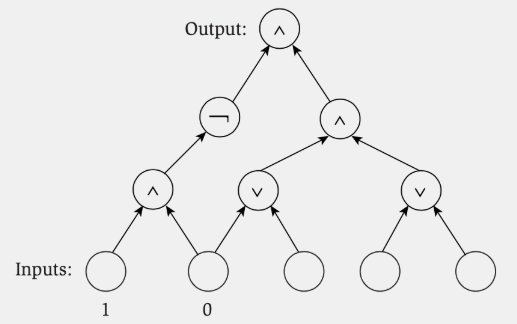
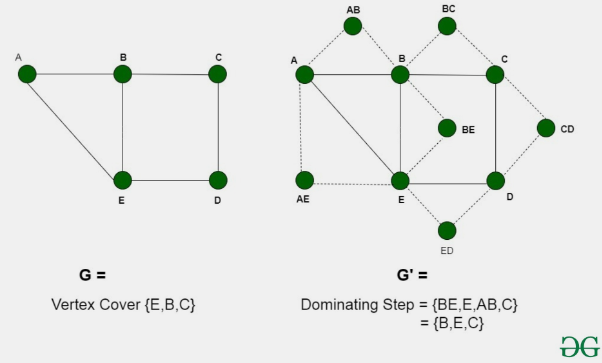
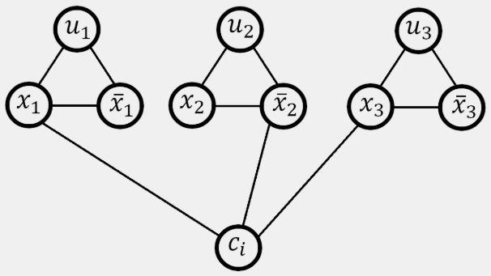
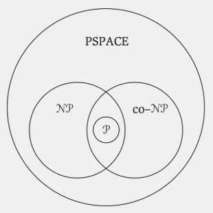
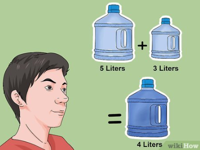

# Reducciones y Clases de Complejidad

## Índice

- [Introducción](#introducción)
- [Reducción](#reducción)
  - [Definición formal](#definición-formal)
- [Ejemplo: Ordenar vs. Encontrar el máximo](#ejemplo-ordenar-vs-encontrar-el-máximo)
- [Ejemplo: Bipartite Matching](#ejemplo-bipartite-matching)
- [Ejemplo: Problema del Caballo y Camino Hamiltoniano](#ejemplo-problema-del-caballo-y-camino-hamiltoniano)
- [Ejemplo: N-Reinas e Independent Set](#ejemplo-n-reinas-e-independent-set)
- [Ejemplo: Subset Sum y Problema de la Mochila](#ejemplo-subset-sum-y-problema-de-la-mochila)
- [Práctica](#práctica)
  - [Búsqueda ordenada vs. Búsqueda desordenada](#búsqueda-ordenada-vs-búsqueda-desordenada)
  - [Búsqueda de máximo vs. Búsqueda desordenada](#búsqueda-de-máximo-vs-búsqueda-desordenada)
  - [Multiplicación vs. Al cuadrado](#multiplicación-vs-al-cuadrado)
- [Problemas de decisión](#problemas-de-decisión)
  - [Independent Set vs. Vertex Cover](#independent-set-vs-vertex-cover)
- [¿Cuál es la utilidad de las reducciones?](#cuál-es-la-utilidad-de-las-reducciones)
- [SAT y 3-SAT](#sat-y-3-sat)
- [Transitividad de las reducciones](#transitividad-de-las-reducciones)
- [Problemas vs. Algoritmos vs. Chequeos](#problemas-vs-algoritmos-vs-chequeos)
- [Clases de Complejidad](#clases-de-complejidad)
  - [¿Están los problemas que vimos en NP?](#están-los-problemas-que-vimos-en-np)
- [P vs. NP](#p-vs-np)
- [Primeras conclusiones](#primeras-conclusiones)
- [Problemas NP-Completos](#problemas-np-completos)
- [Teorema de Cook & Levin: Circuit Satisfiability](#teorema-de-cook--levin-circuit-satisfiability)
- [Cómo demostrar que un problema es NP-Completo](#cómo-demostrar-que-un-problema-es-np-completo)
- [¿3-SAT ≤ Independent Set?](#3-sat-≤-independent-set)
- [El problema de las N-Reinas](#el-problema-de-las-n-reinas)
- [Ejercitación de reducciones](#ejercitación-de-reducciones)
  - ["Ver si un número es múltiplo de otro" a "Ver si un elemento está en una lista"](#ver-si-un-número-es-múltiplo-de-otro-a-ver-si-un-elemento-está-en-una-lista)
  - [Demostrar que K-Clique es NP-Completo usando Independent Set](#demostrar-que-k-clique-es-np-completo-usando-independent-set)
- [Estrategias de reducción](#estrategias-de-reducción)
- [Programación Lineal](#programación-lineal)
- [Problemas de permutaciones](#problemas-de-permutaciones)
  - [El problema del viajante (TSP)](#el-problema-del-viajante-tsp)
  - [Camino Hamiltoniano, ¿es NP-Completo?](#camino-hamiltoniano-es-np-completo)
- [Problemas de Particionamiento](#problemas-de-particionamiento)
  - [Coloreo de Grafos](#coloreo-de-grafos)
- [Problemas Numéricos](#problemas-numéricos)
  - [Subset Sum](#subset-sum)
  - [El Problema de la Mochila](#el-problema-de-la-mochila)
  - [El Problema de Scheduling](#el-problema-de-scheduling)
- [Más reducciones](#más-reducciones)
  - [Dominating Set](#dominating-set)
- [Ausencia de solución en problemas NP](#ausencia-de-solución-en-problemas-np)
- [Complemento a un problema](#complemento-a-un-problema)
- [Clase co-NP](#clase-co-np)
- [¿NP = co-NP?](#np--co-np)
- [La clase NP ∩ co-NP](#la-clase-np--co-np)
- [Más allá de NP](#más-allá-de-np)
- [PSPACE](#pspace)
  - [Mergesort está en PSPACE](#mergesort-está-en-pspace)
  - [Fibonacci está en PSPACE](#fibonacci-está-en-pspace)
  - [Contar un número de 0 a 2^n - 1, ¿está en PSPACE?](#contar-un-número-de-0-a-2n---1-está-en-pspace)
- [Observación sobre el tiempo y el espacio](#observación-sobre-el-tiempo-y-el-espacio)
- [NP y PSPACE](#np-y-pspace)
- [¿P ≠ PSPACE?](#p-≠-pspace)
- [Problemas en PSPACE que "no son NP"](#problemas-en-pspace-que-no-son-np)
  - [Cuantificación (QSAT)](#cuantificación-qsat)
  - [Juegos de 2 jugadores](#juegos-de-2-jugadores)
- [Problemas de planificación](#problemas-de-planificación)
- [Problemas PSPACE-Completos](#problemas-pspace-completos)
- [Más allá de PSPACE](#más-allá-de-pspace)

Muchas veces, cuando se intenta resolver un problema, encontramos similitudes con otros problemas que ya hemos resuelto. Estos problemas pueden ser más sencillos o más complejos que el problema original, y a veces podemos convertir un problema en otro para resolverlo de manera más sencilla. 

Este concepto de "dificultad" entre problemas puede resultarles ambiguo por ahora. Empecemos por nombrar algunos ejemplos de problemas en orden de dificultad creciente: Búsqueda de un elemento en un arreglo ordenado;
Búsqueda de un elemento en un arreglo desordenado; Problema de coloreo con 2 colores; Problema de coloreo con k colores; ... y sigue.

## Reducción

La reducción es una herramienta para comparar la dificultad entre los problemas. Indica que un problema X es al menos tan difícil de resolver como un problema Y.

¿Cuál es el criterio? Vamos a asumir que tenemos una caja negra que resuelve X, y vamos a probar que por tener esta caja ya podemos resolver Y. Se dice que el problema Y es reducible al problema X.

### Definición formal

Una instancia arbitraria del problema Y, ¿puede ser resuelta por una cantidad de pasos polinomiales y una cantidad de llamadas polinomiales a la caja negra que resuelve X?

Si es así, se dice que "Y es reducible polinomialmente a X" y se denota como: $Y \leq_p X$

En otras palabras, resolver Y se reduce a resolver X y hacer una cantidad polinomial de pasos adicionales.

A esto decíamos X es al menos tan difícil como Y.

Si X se puede resolver en tiempo polinomial, entonces Y también se puede resolver en tiempo polinomial.

## Ejemplo: Ordenar vs. Encontrar el máximo

¿Se puede reducir el problema de Encontrar el máximo de un arreglo al problema de Ordenar un arreglo?

Si no supiesemos cómo encontrar el máximo de un arreglo, podríamos reducir el problema a ordenar y ver el último elemento del arreglo ordenado.

Entonces, Ordenar es al menos tan difícil como Encontrar el máximo.

Además, sabemos que hay un algoritmo polinomial para Ordenar, entonces Encontrar el máximo también se puede resolver en tiempo polinomial.

## Ejemplo: Bipartite Matching

Si leyeron el capítulo anterior, recordarán que resolvimos muchos problemas, incluyendo Bipartite Matching, utilizando Flujo Máximo. Esto quiere decir que Bipartite Matching es reducible a Flujo Máximo.

## Ejemplo: Problema del Caballo y Camino Hamiltoniano

El problema del Caballo es un problema de ajedrez que consiste en encontrar un camino que recorra todas las casillas del tablero sin repetir ninguna.

El camino hamiltoniano, si no recuerdan, es un camino que recorre todos los vértices de un grafo sin repetir ninguno.

¿Se puede reducir el problema del Caballo al problema de Camino Hamiltoniano?

Podemos modelar el tablero de ajedrez como un grafo, donde cada casilla es un vértice y cada movimiento posible del caballo es una arista. Aplicando un algoritmo para obtener el camino hamiltoniano, podemos obtener el camino del caballo.

Entonces, el problema del Caballo es reducible al problema de Camino Hamiltoniano.

¿Y al revés? ¿Se puede reducir el problema de Camino Hamiltoniano al problema del Caballo?

No, tendríamos que modelar un grafo cualquiera como un tablero de ajedrez, lo cual mucho sentido no tiene. Acá nos encontramos con un problema específico y un problema general: típicamente, un problema específico se puede reducir a un problema general, pero no al revés.

$Especifico \leq_p General$

## Ejemplo: N-Reinas e Independent Set

El problema de N-Reinas consiste en colocar N reinas en un tablero de ajedrez de tal manera que ninguna se ataque con otra.

El problema de Independent Set consiste en encontrar un conjunto de vértices en un grafo tal que no haya aristas entre ellos.

¿Se puede reducir el problema de N-Reinas al problema de Independent Set?

Sí, podemos modelar el tablero de ajedrez como un grafo, donde cada casilla es un vértice y está conectada con las casillas a las que una reina puede llegar desde allí. Aplicando un algoritmo para obtener el independent set, obtendremos las posiciones de las reinas en las que no se atacan.

Entonces, el problema de N-Reinas es reducible al problema de Independent Set.

## Ejemplo: Subset Sum y Problema de la Mochila

El problema de Subset Sum consiste en encontrar un subconjunto de un conjunto de números tal que la suma de los elementos sea igual o lo más próximo a un valor dado.

El problema de la mochila consiste en llenar una mochila con objetos de tal manera que se maximice el valor total sin exceder el peso máximo.

¿Se puede reducir el problema de Subset Sum al problema de la Mochila?

Sí, podemos modelar el problema de Subset Sum como un problema de la mochila, donde los objetos son los números y el peso de cada objeto es el valor del número. La solución al problema de la mochila corresponderá al subconjunto de números que más se acercan al valor deseado.

Entonces, el problema de Subset Sum es reducible al problema de la Mochila.

## Práctica

Ahora que vimos varios ejemplos de reducciones, vamos a practicar con algunos problemas. ¿Puedo transformar el problema A en el problema B? ¿Y al revés?

## Búsqueda ordenada vs. Búsqueda desordenada

¿Podemos reducir polinomialmente el problema de "Buscar un elemento en un arreglo ordenado" a "Buscar un elemento en un arreglo desordenado"? ¿Y al revés?

La primera pregunta es trivial, ya que buscar un elemento en un arreglo desordenado funciona también para un arreglo ordenado. La segunda no parece posible, pero pensemos en la definición de reducción: ¿podemos hacer una cantidad polinomial de pasos adicionales para buscar un elemento en un arreglo ordenado?

La respuesta es sí, podemos por ejemplo hacer n llamados a búsqueda ordenada para cada elemento del arreglo desordenado. Entonces, "Buscar un elemento en un arreglo desordenado" es reducible a "Buscar un elemento en un arreglo ordenado".

## Búsqueda de máximo vs. Búsqueda desordenada

¿Podemos reducir polinomialmente el problema de "Buscar el máximo de un arreglo" a "Buscar un elemento en un arreglo desordenado"? ¿Y al revés?

Para la primera pregunta, podemos tener en cuenta el valor máximo de un número entero en una máquina. Llamamos a la búsqueda desordenada esa cantidad de veces (por ejemplo, $2^{32}$ veces) y obtenemos el máximo. Esto evidentemente no es polinomial, por lo que no es una reducción polinomial.

Para la segunda pregunta, podemos llamar n veces a "Buscar el máximo de un arreglo", e ir eliminando el máximo encontrado en cada iteración. Si el máximo encontrado es el elemento que buscamos, entonces encontramos el elemento. Si el máximo es menor, entonces no está en el arreglo. Entonces, "Buscar un elemento en un arreglo desordenado" es reducible a "Buscar el máximo de un arreglo".

## Multiplicación vs. Al cuadrado

Suponiendo que podemos usar sumas y restas: ¿Podemos reducir polinomialmente el problema de "Multiplicar dos números" a "Elevar un número al cuadrado"? Al revés seguro ya que es multiplicar dos veces un mismo número.

Podemos tener en cuenta que $(a+b)^2 = a^2 + 2ab + b^2$. Entonces, podemos calcular $a^2$, $b^2$ y $(a+b)^2$ y despejar $ab$. Entonces, "Multiplicar dos números" es reducible a "Elevar un número al cuadrado".

## Problemas de decisión

A partir de ahora vamos a plantear los problemas de una forma más booleana: por ejemplo, en Independent Set el problema es encontrar el set independiente más grande, pero vamos a plantearlo como "¿Existe un set independiente de tamaño k?".

## Independent Set vs. Vertex Cover

Independent Set es un problema que consiste en encontrar un conjunto de vértices en un grafo tal que no haya aristas entre ellos.

Vertex Cover es un problema que consiste en encontrar un conjunto de vértices en un grafo tal que todas las aristas tengan al menos un vértice en el conjunto.

Ninguno de los dos son resolubles en tiempo polinomial, pero ¿se pueden reducir entre sí?

Hay un teorema al respecto: S es un independent set en G si y solo si V-S es un vertex cover en G. Entonces, "Independent Set" es reducible a "Vertex Cover" y viceversa.

Demostración: Si tengo un independent set S, dada una arista (u, v) en G, no pueden ambos estar en S, entonces al menos uno de los dos está en V-S. Entonces, V-S es un vertex cover.

Si tengo un vertex cover V-S, y agarramos cualquier par de vértices en S. Si hubiesen una arista entre ellos, el vertex cover no estaría teniendo esa arista en cuenta. Entonces, S es un independent set.

Como $Independent Set \leq_p Vertex Cover$ y $Vertex Cover \leq_p Independent Set$, entonces ambos problemas son equivalentes en términos de dificultad.

## ¿Cuál es la utilidad de las reducciones?

Como ya mencionamos, puede servir para determinar que X se puede resolver en tiempo polinomial si Y también se puede resolver en tiempo polinomial, dado $Y \leq_p X$.

Si sabemos que Y no se puede resolver en tiempo polinomial, entonces X tampoco se puede resolver en tiempo polinomial. Ya que, X es al menos tan difícil como Y.

Supongamos que encontramos una solución polinomial para Independent Set. Entonces, por la reducción a Vertex Cover, también encontramos una solución polinomial para Vertex Cover.

Entonces, si encontramos una solución polinomial a un problema para el cual no se conocía una solución polinomial, habremos encontrado una solución polinomial para todos los problemas que se pueden reducir a ese problema.

## SAT y 3-SAT (Satifisfiability)

SAT es un problema que consiste en determinar si una fórmula booleana (que consiste en cláusulas con OR concatenadas por AND) es satisfacible, es decir, si existe una asignación de valores a las variables que haga que la fórmula sea verdadera. Por ejemplo, $(x_1 \lor x_2) \land (\neg x_1 \lor x_3) \land (\neg x_2 \lor x_3)$ es satisfacible si asignamos $x_1 = true$, $x_2 = false$ y $x_3 = true$.

3-SAT es un problema similar, pero las cláusulas separadas por AND tienen exactamente 3 variables. Por ejemplo, $(x_1 \lor x_2 \lor x_3) \land (\neg x_1 \lor x_2 \lor x_3) \land (\neg x_1 \lor \neg x_2 \lor x_3)$.

Evidentemente, 3-SAT es más específico que SAT, y se puede reducir a SAT. ¿Se puede reducir SAT a 3-SAT?

Para cláusulas de 1 o 2 variables, es trivial: podemos agregar variables auxiliares que no afecten el resultado. Por ejemplo, si tenemos 2 variables $(x \lor y)$, podemos agregar una variable $z$ y reemplazar por $(x \lor y \lor z) \land (x \lor y \lor \neg z)$. Esta nueva expresión es verdadera si y solo si $(x \lor y)$ lo es, indiscriminadamente del valor de $z$.

Para cláusula de 1 variable $(x)$, podemos reemplazar por $(x \lor z_1 \lor z_2) \land (x \lor z_1 \lor \neg z_2) \land (x \lor \neg z_1 \lor z_2) \land (x \lor \neg z_1 \lor \neg z_2)$. Esta nueva expresión es verdadera si y solo si $(x)$ lo es, indiscriminadamente del valor de $z_1$ y $z_2$.

Para cláusula de más de 3 variables, aplicamos lo siguiente:

$(l_1 \lor l_2 \lor z_1) \land (l_3 \lor \neg z_1 \lor z_2) \land (l_4 \lor \neg z_2 \lor z_3) ... \land (l_{k-2} \lor \neg z_{k-4} \lor z_{k-3}) \land (l_{k-1} \lor l_k \lor \neg z_{k-3})$

Esta fórmula no es equivalente a la original, como lo eran en los otros casos. Pero sí se puede demostrar que si y solo si la fórmula original es satisfacible, esta nueva fórmula también lo es. Entonces, SAT es reducible a 3-SAT.

Para darles una idea de cómo es la demostración, pensemos en una cláusula de k variables. La cláusula va a ser falsa sólo si todas las variables son falsas. Vamos a demostrar que en este caso, es imposible que la serie propuesta de cláusulas de 3 variables sea verdadera.

Habiendo obtenido la nueva expresión, para que el primer término $(l_1 \lor l_2 \lor z_1)$ sea verdadero, $z_1$ tiene que ser verdadero. En el segundo término $(l_3 \lor \neg z_1 \lor z_2)$, como $z_1$ es verdadera, $z_2$ tiene que ser verdadera. Esto sigue hasta llegar al término $(l_{k-2} \lor \neg z_{k-4} \lor z_{k-3})$, donde $z_{k-3}$ tiene que ser verdadera. ya que $z_{k-4}$ debió ser verdadero en el término anterior. Ahora llegado al último término, $(l_{k-1} \lor l_k \lor \neg z_{k-3})$, como $z_{k-3}$ debe ser falso, entonces queda demostrado que no es posible encontrar una asignación de valores para $z_i$ que haga que la fórmula sea verdadera.

No lo voy a abarcar los demás casos en este documento, pero si les interesa pueden encontrar la demostración completa en el siguiente link de OpenDSA, desde el slide 29: [Reducción de SAT a 3-SAT](https://opendsa-server.cs.vt.edu/OpenDSA/Books/Everything/html/SAT_to_threeSAT.html).

## Transitividad de las reducciones

Si tenemos que $A \leq_p B$ y $B \leq_p C$, entonces $A \leq_p C$.

Por ejemplo, si encontramos una reducción de 3-SAT a Independent Set y de Independent Set a Vertex Cover, queda demostrado que 3-SAT es reducible a Vertex Cover.

## Problemas vs. Algoritmos vs. Chequeos

Dado un problema y una solución (algoritmo), necesitamos un validador para chequear que la solución es correcta.

Decimos que tenemos un *certificador eficiente* si dicho validador es correcto y se ejecuta en tiempo polinomial.

Por ejemplo, buscar un Independent Set requiere un tiempo exponencial, pero verificar que el conjunto encontrado es efectivamente un Independent Set se puede hacer en tiempo polinomial, simplemente chequeando que no haya aristas entre los vértices.

## Clases de Complejidad

- P: Problemas que se pueden resolver en tiempo polinomial (de forma eficiente). Pueden ser resueltos en tiempo polinomial por una máquina de Turing determinística.
- NP: Problemas para los que existe un certificador eficiente, es decir, pueden ser validados en tiempo polinomial. Pueden ser resueltos en tiempo polinomial por una máquina de Turing no determinística.

## ¿Están los problemas que vimos en NP?

Vamos a hablar de validadores de problemas de decisión, ya que para validar un problema de optimización (el mejor camino, etc.) muchas veces se requiere resolver el mismo problema.

Todos los problemas resolubles en tiempo polinomial están en NP, ya que si se puede resolver en tiempo polinomial, también se puede validar en tiempo polinomial.

- Búsqueda del máximo en un arreglo.
- Determinar si un grafo es bipartito.
- Problema de Scheduling: determinar si se pueden dar k charlas entre las n posibles.
- Puntos más cercanos en un plano: validar si para todo par de puntos la distancia es mayor a k.
- Flujo en una red: resoluble en tiempo polinomial.
- Problema de la mochila: recordemos que era pseudopolinomial. Lo que se puede validar es si un subconjunto de objetos es una solución válida con valor mayor a k.
- N Reinas.
- Independent Set.
- Vertex Cover.
- 3-SAT: verificar que la asignación de valores a las variables hace que la fórmula sea verdadera.
- Verificar una contraseña: utilizar hashing para verificar que la contraseña es correcta.

## P vs. NP

$¿P \subseteq NP?$

P es un subconjunto de NP, ya que si un problema se puede resolver en tiempo polinomial, también se puede validar en tiempo polinomial.

$¿P \supseteq NP?$ ($¿P = NP?$)

En el caso de Independent Set, que es NP, no conocemos un algoritmo polinomial para resolverlo. Pareciera que es falso, pero no se ha demostrado.

## Primeras conclusiones

1. Podemos comparar la dificultad de problemas transformando, reduciendo unos a otros.
2. Reducir Y a X implica que X es al menos tan complicado como Y. No dice cuán complicado es Y.
3. Hay problemas fáciles, difíciles y los más difíciles.
4. Empezamos a ver clases de complejidad.

## Problemas NP-Completos

$X \in NP-Completo$ sii:

1. $X \in NP$
2. $\forall Y \in NP, Y \leq_p X$

Es decir, un problema es NP-Completo si es NP y todos los problemas en NP se pueden reducir a él.

No es trivial la existencia de problemas NP-Completos, pero se demostró que existen.

También existe el concepto de NP-Hard, que a diferencia de NP-Completo, no necesariamente está en NP:

$X \in NP-Hard$ sii:

$\forall Y \in NP, Y \leq_p X$

### Algunas observaciones

1. Si X es un problema NP-Completo, sólo puede resolverse en tiempo polinomial si P = NP: ya que existen problemas en NP que no se pueden resolver en tiempo polinomial.
2. Si al menos un problema NP-Completo puede resolverse en tiempo polinomial, entonces todos los problemas en NP pueden resolverse en tiempo polinomial: entonces, P = NP.

## Teorema de Cook & Levin: Circuit Satisfiability

Un problema famosamente NP-Completo es Circuit Satisfiability, que consiste en determinar si una fórmula booleana que representa un circuito lógico es satisfacible. Es decir, si existe una asignación de valores a las variables que haga que la salida del circuito sea verdadera. Este problema es análogo a SAT que ya vimos, que es también NP-Completo.

En este documento no vamos a profundizar en la demostración del NP-Completeness de Circuit Satisfiability, pero pueden encontrarla en el siguiente video: [circuit satisfiability is NP-complete](https://youtu.be/PZlofHxS-Mw?si=W6sVDCCEIS2JvooG).

## Cómo demostrar que un problema es NP-Completo

1. Demostrar que el problema está en NP.
2. Elegir un problema conocido que sea NP-Completo.
3. Reducir el problema conocido al problema que queremos demostrar que es NP-Completo.

Dados X un problema NP-Completo y Y un problema en NP:

Por teorema de transitividad, si $X \leq_p Y$, entonces $Y$ es NP-Completo ya que $Z \leq_p X \leq_p Y$ para todo Z en NP.

*Teorema de transitividad: Si tenemos que $A \leq_p B$ y $B \leq_p C$, entonces $A \leq_p C$.*

Otro ejemplo de problema NP-Completo es 3-SAT, que ya vimos que es reducible a SAT.

## ¿3-SAT $\leq_p$ Independent Set?

*Recordatorio: en esta sección siempre vamos a estar hablando de problemas de decisión. Es decir, determinar la existencia de una solución, no encontrar la solución en sí.*

Dado 3-SAT con k cláusulas:

1. Creamos un grafo con grupos de 3 nodos por cada cláusula: 3k nodos.
2. Conectamos los nodos de cada grupo con aristas.
3. Conectamos los nodos que representan variables que se niegan entre sí: si tenemos $x$ en una cláusula y $\neg x$ en otra, los conectamos.
4. Es posible demostrar que G tiene un Independent Set de tamaño k si y solo si la fórmula es satisfacible.

**Si hay 3-SAT, hay Independent Set de tamaño k.**

Si existe una asignación de valores a las variables que hace que la fórmula sea verdadera, entonces al menos un nodo de cada grupo de 3 nodos va a ser verdadero en dicha asignación. Como variables que se niegan entre sí no pueden ser verdaderas al mismo tiempo y dos nodos en cláusulas distintas sólo están conectados si se niegan entre sí, si elegimos los nodos verdaderos de cada grupo de 3 nodos, obtenemos un Independent Set de tamaño k.

**Si hay Independent Set de tamaño k, hay 3-SAT.**

Por cada $x_i$, si está en el set, le asignamos verdadero. Si está el complemento en el set, le asignamos falso. Si no están ni $x_i$ ni su complemento, le asignamos cualquier valor respetando la negación.

Como el Independent Set tiene tamaño k, hay exactamente un nodo verdadero por cada grupo de 3 nodos. Y como estamos asignando verdadero a al menos una variable de cada cláusula sin contradicciones, la fórmula es satisfacible.

Entonces, 3-SAT es reducible a Independent Set, y por lo tanto Independent Set es NP-Completo.

Además, como ya vimos anteriormente, Independent Set es reducible a Vertex Cover, por lo que Vertex Cover también es NP-Completo.

## El problema de las N-Reinas

El problema de N-Reinas consiste en colocar N reinas en un tablero de ajedrez de tal manera que ninguna se ataque con otra. Habíamos visto que este problema es reducible a Independent Set, ¿pero es posible viceversa?

No vamos a demostrarlo en este documento, pero se puede demostrar que Independent Set es reducible a N-Reinas. Es decir, N-Reinas es NP-Completo. Si desea ver la demostración completa, puede encontrarla en los siguientes links: [A polynomial time algorithm for the N-Queens problem](https://dl.acm.org/doi/10.1145/101340.101343), [Explicit solutions to the N-queens problem for all N](https://dl.acm.org/doi/10.1145/122319.122322).

## Ejercitación de reducciones

### "Ver si un número es múltiplo de otro" a "Ver si un elemento está en una lista"

    
Posible solución

    1. Crear un arreglo de múltiplos del número hasta llegar a un número mayor que el número a verificar, excluyendo éste.
    2. Verificar si el número está en el arreglo.

### Demostrar que K-Clique es NP-Completo usando Independent Set

K-Clique es un problema que consiste en encontrar un conjunto de k vértices en un grafo tal que todos estén conectados entre sí.

    
Posible solución

    1. Verificar que K-Clique está en NP. Implementar un certificador eficiente.
    2. Creamos un grafo G' que es el complemento de G. Es decir, para todo par de nodos en G que no están conectados, los conectamos en G', y si están conectados, no los conectamos.
    3. Hay Independent Set de tamaño k en G si y solo si hay K-Clique de tamaño k en G'. Ya que, todos los nodos del K-Clique en G' no están conectados entre sí en G, y viceversa.

    Entonces, Independent Set es reducible polinomialmente a K-Clique y por lo tanto K-Clique es NP-Completo.

## Estrategias de reducción

1. **Reducción por equivalencia simple**: Independent Set y Vertex Cover, Independent Set y K-Clique.
2. **Reducción de caso especial a caso general**: N-Reinas a Independent Set.
3. **Reducción por encodeo de características**: 3-SAT a Independent Set. Es cuando se codifican las características de un problema en las de otro muy diferente.

## Programación Lineal

Cuando vimos programación lineal, estuvimos reduciendo problemas de diferentes tipos a un problema de programación lineal.

Programación lineal, ¿está en NP? Sí, ya que se puede validar en tiempo polinomial.

Programación lineal, ¿es NP-Completo? Sí en el caso de programación lineal entera, es trivial reducir Independent Set a programación lineal entera. En el caso de programación lineal no entera, no se ha demostrado que sea NP-Completo. Si se demostrase, se demostraría que P = NP.

*Recordatorio: Mientras que la complejidad temporal de programación lineal no entera es polinomial, la de programación lineal entera es exponencial.*

## Problemas de permutaciones

### El problema del viajante (TSP)

El problema del viajante consiste en encontrar el camino más corto que recorra todos los vértices de un grafo y vuelva al vértice inicial. Puede pasar más de una vez por cada vértice si es necesario.

Planteemoslo como un problema de decisión: ¿Existe un camino de costo/distancia menor a D?

Primero vamos a ver su relación con el Ciclo Hamiltoniano; ciclo que recorre todos los vértices de un grafo sin repetir ninguno, sin considerar el costo de las aristas.

Cómo reducir Ciclo Hamiltoniano a TSP:

1. Dado un grafo G, creamos un grafo G' que es el mismo que G, pero con todas las aristas de peso 1.
2. Para todo par de nodos en G que no están conectados, los conectamos en G' con una arista de peso 2.
3. Existe un ciclo hamiltoniano en G si y solo si existe un camino de viajante de costo n en G'. Ya que, para que pueda pasar por todos los nodos con costo menor o igual a n, tiene que pasar únicamente por las aristas de peso 1 (las existentes en el grafo) y a lo sumo una vez por cada arista.

**¿TSP está en NP? ¿Y Ciclo Hamiltoniano?**

Ambos pueden ser trivialmente validados en tiempo polinomial, por lo que están en NP. Entonces, si logramos reducir un problema NP-Completo a TSP, demostramos que TSP es NP-Completo. No que Ciclo Hamiltoniano sea NP-Completo, ya que la reducción que hicimos fue de Ciclo Hamiltoniano a TSP; es decir, reducimos un problema NP a uno NP-Completo. Pero si logramos reducir un problema NP-Completo a Ciclo Hamiltoniano, demostramos que Ciclo Hamiltoniano es NP-Completo, y por lo tanto TSP también lo es.

### 3-SAT a Ciclo Hamiltoniano

¿Por qué 3-SAT y no otro problema? No necesariamente tiene que ser 3-SAT, pero suele ser un buen punto de partida si no se tiene un problema específico en mente porque su naturaleza combinatoria es bastante simple.

¿Dado una instancia de 3-SAT, cómo definimos si es satisfacible por tener una caja negra que resuelve Ciclo Hamiltoniano?

La reducción es bastante compleja por lo que no la vamos a abordar en este documento, pero pueden encontrarla en el siguiente video: [Intractabilidad - Ciclo Hamiltoniano - Ing. Víctor Daniel Podberezki](https://youtu.be/q7dtN6g8OFc?si=6iyTX0QJqLRF8bCM)

### Camino Hamiltoniano, ¿es NP-Completo?

Camino Hamiltoniano es un camino que recorre todos los vértices de un grafo sin repetir ninguno. La diferencia radica en que tiene puntos de partida y llegada distintos, sin volver al punto de partida.

1. **¿Está en NP?** Sí, se puede validar en tiempo polinomial.
2. **¿Es NP-Completo?**

Intentemos reducir Ciclo Hamiltoniano a Camino Hamiltoniano:

1. Dado un grafo G, elegimos un vértice $v$ al azar y lo reemplazamos por dos vértices: $v'$ con todas las aristas que salen de él y $v''$ con todas las aristas que llegan a él.
2. Existe un ciclo hamiltoniano en G si y solo si existe un camino hamiltoniano en G'. El camino hamiltoniano va a ser uno que empieza en $v'$, recorre todos los vértices de G y termina en $v''$.

Pensemos que el camino es exactamente el mismo que el ciclo si consideramos que $v'$ y $v''$ son el mismo vértice.

Entonces, Camino Hamiltoniano es NP-Completo.

### Dado tres números a, b y c, escribir un algoritmo que determine si a + b = c

1. **¿Está en NP?** Sí, se puede validar en tiempo polinomial.
2. **¿Está en P?** Sí, se puede resolver en tiempo polinomial.
3. **¿Cómo reducimos este problema a TSP?**

    
Posible solución

    1. Creamos un grafo G con 3 nodos, uno para cada número.
    2. Conectamos los nodos a y b con una arista de peso a. Conectamos los nodos b y c con una arista de peso b. Conectamos los nodos c y a con una arista de peso a + b.
    3. Si existe un camino de costo a + b + c en G, entonces a + b = c.

4. **¿Qué implica que hayamos reducido este problema a TSP?** Que TSP es NP-Completo. Reducimos un problema en NP a uno NP-Completo.
5. **¿Podemos reducir polinomialmente TSP a este problema?** Enviar solución al siguiente mail para poder verificarlo: [hg.cld.koo@gmail.com](mailto:hg.cld.koo@gmail.com)

## Problemas de Particionamiento

Son problemas en donde buscamos dividir un conjunto de objetos/datos/vértices/etc.

### Coloreo de Grafos

El problema de coloreo de grafos consiste en asignar un color a cada vértice de un grafo de tal manera que vértices adyacentes no tengan el mismo color. En esta sección hablamos de k-coloreo: determinar si es posible colorear el grafo con k colores.

Cuando k = 2, el problema es equivalente a determinar si es un grafo bipartito, que podemos resolver en tiempo lineal.

Cuando k = 3, el problema es NP-Completo.

**¿3-Coloring es NP-Completo?**

1. **¿Está en NP?** Sí, se puede validar en tiempo polinomial, simplemente verificando que no haya vértices adyacentes con el mismo color.
2. **¿Es NP-Completo?**

Pareciera que Independent Set es una buena opción dado que utilizan ambos un grafo y se basan en la misma idea de no tener vértices adyacentes. Sin embargo, no es sencillo buscar una reducción de 3-Coloring a Independent Set: Independent Set busca por la cantidad de nodos y 3-Coloring por la cantidad de colores.

Sin tener un buen punto de partida, vamos a intentar reducir 3-SAT a 3-Coloring.

1. Creamos un nodo por cada variable $x_i$ y su negación $\neg x_i$.
2. Unimos los nodos de una variable y su negación.
3. Creamos 3 nodos especiales: True, False y Base.
4. Unimos a cada variable y complemento con Base, para formar triángulos.
5. Unimos True, False y Base, formando otro triángulo.

Llamemos a los 3 colores True, False y Base. $v_i$ y su complemento, al estar unidos entre sí y con Base, deben ser True y False.

Ahora vamos a incorporar las expresiones. Podemos representar el OR en nuestro grafo de la siguiente manera:

Las variables a y b (pueden ser una variable negada) se encuentran conectadas a Base, por lo que deben tomar valores True o False. 

El nodo gris $a'$ conectado a $a$ puede tomar como valor Base o el negado de $a$. 

El nodo gris $b'$ conectado a $b$ puede tomar como valor Base o el negado de $b$.

Estos dos nodos forman un triángulo junto al nodo que representa $a \lor b$; no es necesario conectar éste con Base (en un instante explico por qué) pero pueden imaginarse que lo está, por lo que puede tomar sólo True o False. Entonces, el nodo OR puede ser True sólo si a o b es True: como el triángulo debe tener True, False y Base, uno de los nodos $a'$ o $b'$ debe ser Base y el otro False para que el nodo OR pueda ser True.

Ahora representamos la cláusula entera $(a \lor b \lor c)$ como $((a \lor b) \lor c)$, y conectamos el resultado con Base y False:

De esta forma, podemos forzar que el nodo que representa la cláusula entera sea True.

Volviendo a lo que les decía, no es necesario conectar el nodo $a \lor b$ con Base ya que al ser que $a'$ y $b'$ están conectados, la única forma de que $a \lor b$ sea True es que uno entre $a$ y $b$ sea True y el otro False, ya que si coincidiesen sus valores, necesariamente $'a$ o $'b$ debería ser Base. Y es trivial ver que si $a \lor b$ es Base, existe forma de asignar colores de forma que $a \lor b \lor c$ sea True: asignamos True a $a \lor b \lor c$, False a $(a \lor b)'$ y Base a $c'$.

Cubriendo todas las cláusulas, habremos reducido 3-SAT a 3-Coloring. Entonces, 3-Coloring es NP-Completo.

### Bipartito a 3-Coloring

¿Cómo reducimos "determinar si un grafo es bipartito" a 3-Coloring?

Posible solución

Podemos agregar un vértice conectado a todos los vértices originales. Éste necesariamente va a tener que tener un color distinto a los demás, y el problema pasa a ser 2-Coloring con el resto de los vértices.

### Generalización: 3-Coloring a K-Coloring con K > 3

¿Cómo reducimos 3-Coloring a K-Coloring con K > 3?

Posible solución

Análogamente al ejercicio anterior, podemos agregar K - 3 vértices conectados a todos los vértices originales, y entre sí. Éstos necesariamente van a tener que tener un color distinto a los demás, y el problema pasa a ser 3-Coloring con el resto de los vértices.

Dada la reducción, podemos afirmar que K-Coloring es NP-Completo.

## Problemas Numéricos

### Subset Sum

Dado un conjunto de n elementos y un valor k, ¿existe un subconjunto cuya suma sea igual a k?

Habíamos visto en Programación Dinámica que es posible resolverlo en tiempo pseudopolinomial: $O(nW)$. Es decir, no depende del tamaño de la entrada, sino de los valores de los elementos (por lo que termina siendo exponencial, salvo que W sea un valor polinomialmente dependiente de n).

¿Es tan problemático que sea "pseudopolinomial"? ¿No podría haber algún algoritmo polinomial para resolverlo?

Resulta que, Subset Sum es un problema NP-Completo. Es decir, no se conoce un algoritmo polinomial para resolverlo.

1. **¿Está en NP?** Sí, se puede validar en tiempo polinomial.
2. **¿Es NP-Completo?** Se puede reducir un problema NP-Completo (por ejemplo, 3-dimensional-matching) a Subset Sum. No lo desarrollaremos aquí, pero pueden encontrar la demostración en el siguiente link: [Subset Sum](hhttps://www.cs.toronto.edu/~lalla/373s16/notes/SS.pdf)

### El Problema de la Mochila

Dado un conjunto de n elementos con un peso y un valor, y un peso máximo W, ¿cuál es el valor máximo que puedo llevar en la mochila?

Ya habíamos visto que Subset Sum es reducible al problema de la mochila, al ser Subset Sum un caso particular de ello. Sabiendo que el problema está en NP, queda demostrado que el problema de la mochila es NP-Completo. Éste es otro problema que habíamos visto que es pseudopolinomial.

### El Problema de Scheduling

Veamos un caso más general de Scheduling: dado un conjunto de tareas con duración, deadline y *release time* (momento en el cual la tarea comienza a estar disponible), queremos minimizar la latencia máxima.

Este problema es NP-Completo. ¿Cómo lo demostramos?

1. **¿Está en NP?** Sí, se puede validar en tiempo polinomial.
2. **¿Es NP-Completo?**

Es posible reducir Subset Sum a este problema. Dado el conjunto de elementos $[(w_1, v_1), (w_2, v_2), ..., (w_n, v_n)]$ y un valor k para Subset Sum:

1. Definimos a S como la suma de todos los elementos.
2. Creamos las tareas: la tarea i tiene duración $w_i$, release time 0 y deadline $S + 1$.
3. Creamos una n-ésima tarea con release time W y deadline W + 1, de duración 1.
4. Si el problema de scheduling puede resolverse con latencia máxima 0, es porque se pudieron ubicar tareas que suman exactamente W en el intervalo [0, W]. Entonces, la n-ésima tarea se puede ubicar en el intervalo [W, W + 1] y la latencia máxima se mantiene en 0. Caso contrario, la latencia máxima sería 1. Además no puede haber tiempo muerto ya que en ese caso el tiempo total consumido sobrepasaría a $S + 1$ y se generaría latencia en la tarea asignada última.

## Más reducciones

### Dominating Set

Un set dominante de un grafo es un subconjunto de vértices tal que todos los vértices o bien están en el conjunto, o son adyacentes a alguno de los vértices del conjunto.

Problema de decisión: dado un grafo y un número k, ¿existe un set dominante de tamaño k o menor?

Demostremos que Dominating Set es NP-Completo.

1. **¿Está en NP?** Sí, se puede validar en tiempo polinomial.
2. **¿Es NP-Completo?**

Podemos reducir Vertex Cover a Dominating Set.

*Vertex Cover: dado un grafo y un número k, ¿existe un set de vértices de tamaño k o menor tal que todas las aristas tengan al menos un vértice en el set?*

Son problemas muy similares, pero no son equivalentes. Por ejemplo, un grafo con 3 vértices conectados entre sí tiene un Dominating Set de tamaño 1, pero no tiene Vertex Cover de tamaño 1 (le faltaría cubrir una arista).

La clave de esta reducción está en que Vertex Cover consiste en cubrir todas las aristas mientras que Dominating Set consiste en cubrir todos los vértices. En otras palabras, al menos una arista de cada vértice (Para un grafo conexo. Lo que quiero destacar es la relación conjunto-subconjunto de aristas tomadas en cuenta para cada problema). Entonces, debemos buscar una forma en la que Dominating Set tome en cuenta las aristas.

1. Dado un grafo G, agregamos un vértice por cada arista, y los conectamos con los vértices que conecta la arista. De esta forma, un set dominante en el nuevo grafo tendrá en cuenta los vértices "aristas".
2. Si el grafo original tiene un Vertex Cover de tamaño k, entonces los mismos vértices forman un Dominating Set de tamaño k en el nuevo grafo. Si hay un dominant set de tamaño k en el nuevo grafo, entonces los mismos vértices forman un Vertex Cover de tamaño k en el grafo original.

Dada la relación si y solo si, queda demostrado que Dominating Set es NP-Completo.

¿Y si utilizamos 3-SAT en lugar de Vertex Cover?

Lo que podría venir a la mente más rápido es tener vértices para cada variable y unir los vértices que comparten cláusula. Esto no funciona, pensemos en el siguiente caso: una variable que está junto con todas las demás en distintas cláusulas, habiendo una cláusula que no la incluye:

$(x_1 \lor x_2 \lor x_3) \land (x_1 \lor x_4 \lor x_5) \land (x_2 \lor x_3 \lor x_4)$

En ese caso, la última cláusula termina siendo irrelevante para el Dominating Set ya que $x_1$ está conectada con todas las demás variables en el grafo y es suficiente para formar un Dominating Set.

¿Cómo hacemos que todas las cláusulas sean tomadas en cuenta? Podemos agregar un vértice por cada cláusula y conectarlo con los vértices que representan las variables de la cláusula.

Dado un conjunto de m cláusulas y n variables:

1. Creamos un grafo de 3n + m vértices: un nodo por cada variable $x_i$, por cada complemento $\neg x_i$, y uno extra $u_i$, y uno por cada cláusula.
2. Formamos triángulos entre el vértice de $x_i$, $\neg x_i$ y $u_i$. La variable $u_i$ sólo quedará conectada con $x_i$ y $\neg x_i$, por lo que algún nodo del triángulo debe ser parte del Dominating Set. Si $u_i$ es parte del Dominating Set, significa que su valor es irrelevante.
3. Unimos vértices de variables/complementos a los de las cláusulas a las que pertenecen.
4. Hay Dominating Set de cantidad de vértices a lo sumo k = n sii el problema de 3-SAT es satisfacible. 

Hay Dominating Set -> Es satisfacible:

Tenemos n triángulos para cada variable, en donde cada triángulo debe tener al menos un vértice en el Dominating Set. Como determinamos k = n, no puede haber más de uno por triángulo. Luego, para que los vértices de las cláusulas sean dominados, alguna de sus variables deben estar en el set dominante. Entonces, si hay Dominating Set, esa asignación de valores a las variables hace que la fórmula sea verdadera.

Es satisfacible -> Hay Dominating Set:

Si tenemos una asignación de variables/complementos que hace que la fórmula sea verdadera, entonces podemos poner los vértices de las variables/complementos que son verdaderos en el Dominating Set. Cualquier asignación hace que los triángulos de las variables sean dominados(ya que para toda variable, o es verdadera o su complemento lo es), y para las cláusulas, al menos una variable de cada cláusula es verdadera por definición de satisfacibilidad.

## Ausencia de solución en problemas NP

Volvamos a la definición de problemas NP:

Problemas para los que existe un certificador eficiente, es decir, pueden ser validados en tiempo polinomial. Pueden ser resueltos en tiempo polinomial por una máquina de Turing no determinística.

Es fácil demostrar que un determinado camino suma a lo sumo 100 y que recorre por todos los nodos para una instancia de TSP. Pero no es tan fácil demostrar que no existe un camino que sume a lo sumo 100; deberíamos probar todas las posibles combinaciones de caminos.

## Complemento a un problema

$\neg X$ es un problema donde una instancia que tiene solución en $X$ no tiene solución en $\neg X$, y viceversa.

*Tener solución significa que la instancia cumple con las condiciones para que la pregunta planteada en el problema sea afirmativa.*

Si $X \in P$, entonces $\neg X \in P$. Ya que, podemos utilizar el mismo algoritmo que resuelve $X$ y negar su respuesta.

Y si $X \in NP$, ¿$\neg X \in NP$? No necesariamente. Para un problema como "¿Existe algún camino/selección/partición, ...", su complemento es "Ningún camino/selección/partición, ...". Por ejemplo, para el problema de la mochila, es fácil verificar que un subconjunto de objetos es una solución válida, pero para verificar que no hay solución, deberíamos o probar todas las posibles combinaciones de objetos o resolver el mismo problema en tiempo pseudopolinomial.

## Clase co-NP

Si un problema pertenece a NP, es fácil validar una solución.

Si un problema pertenece a co-NP, es fácil demostrar que algo no es solución/no tiene solución.

## ¿NP = co-NP?

No se sabe, pero se cree que no.

Si $NP \neq co-NP$, $P \neq NP$:

Demostremoslo con método indirecto; asumiendo que $P = NP$, llegaremos a que $NP = co-NP$.

$X \in NP \Rightarrow X \in P \Rightarrow \neg X \in P \Rightarrow \neg X \in NP \Rightarrow X \in co-NP$

$X \in co-NP \Rightarrow \neg X \in NP \Rightarrow \neg X \in P \Rightarrow X \in P \Rightarrow X \in NP$

Es decir, si $P = NP$, entonces $NP = co-NP$, por lo que si $NP \neq co-NP$, entonces $P \neq NP$.

## La clase $NP \cap co-NP$

Un problema podría estar en ambas clases, por ejemplo los problemas en P.

¿$P = NP \cap co-NP$?

No se sabe, y en este caso tampoco hay una creencia común.

## Más allá de NP

Hasta ahora analizamos los problemas en función de la complejidad temporal, pero también podemos hacerlo en función de la complejidad espacial.

## PSPACE

Problemas que se resuelven con un algoritmo que consume una cantidad polinomial de espacio.

1. ¿Mergesort está en PSPACE?

Respuesta

Sí, utiliza O(n) espacio en cada hoja de la recursión, luego mergeándolos.

2. ¿Fibonacci está en PSPACE?

Respuesta

Sí, es posible incluso resolverlo en O(1) espacio (guardando referencia a los dos últimos números).

3. ¿P está en PSPACE?

Respuesta

Sí, porque un algoritmo que se ejecuta en tiempo polinomial nunca puede usar más que una cantidad polinomial de espacio, ya que el tiempo limita las configuraciones posibles que necesita explorar.

4. Contar un número de 0 a 2^n - 1, ¿está en PSPACE?

Respuesta

Sí, hablando en binario, se puede hacer en O(n) espacio ya que necesitamos hasta n bits para representar el número actual.

Este problema tiene complejidad temporal exponencial, pero espacial polinomial.

## Observación sobre el tiempo y el espacio

> El espacio se puede reutilizar, pero el tiempo no.  
>  
> – Martín Buchwald

## NP y PSPACE

Podemos resolver 3-SAT en espacio polinomial: reservamos memoria para las variables y vamos probando todas las combinaciones posibles. Tiene complejidad temporal exponencial, pero espacial polinomial.

Como 3-SAT es NP-Completo y todos los problemas NP se pueden reducir polinomialmente a él, todos los problemas NP se pueden resolver en espacio polinomial.

$NP \subseteq PSPACE$

## ¿$P \neq PSPACE$?

Como podrán imaginar, no se demostró aún que $NP = PSPACE$. Y como tampoco se demostró que $P \neq NP$, nisiquiera sabemos si $P \neq PSPACE$, aunque es muy intuitivo pensar que no son iguales.

## Problemas en PSPACE que "no son NP"

### Cuantificación (QSAT)

Volvemos a 3-SAT: tenemos n variables, y una fórmula booleana que es una disyunción de conjunciones de 3 términos.

Un problema de 3-SAT:

$$
\exists x_1 \exists x_2 \cdots \exists x_{n-2} \exists x_{n-1} \exists x_n \, \Phi(x_1, \dots, x_n)?
$$

Un problema de Quantified 3-SAT:

$$
\exists x_1 \forall x_2 \cdots \exists x_{n-2} \forall x_{n-1} \exists x_n \, \Phi(x_1, \dots, x_n)?
$$

Es decir, pregunta si existe una asignación de valores a variables impares que haga que la fórmula sea verdadera independientemente de los valores de las variables pares.

Esto implica que para validar la solución, necesitamos probar todas las combinaciones posibles de las variables pares, dadas las asignaciones de las variables impares. Es decir, no está en NP.

Supongamos que usamos fuerza bruta: podemos usar 2 arreglos, uno con los valores de las variables impares y otro con los valores de las variables pares. En cada llamada recursiva podemos ir descartando las variables pares para ver si la fórmula es verdadera sin ellas. Esto consume espacio polinomial, QSAT es un problema en PSPACE.

### Juegos de 2 jugadores

1. Ajedrez
2. Go
3. Competitive Facility Location Problem

Competitive Facility Location Problem es un "juego" en donde los proveedores de servicios eligen ubicaciones de sus instalaciones para maximizar la ganancia. El juego se modela de la siguiente forma: dado un grafo cuyos vértices representan la ubicación y tienen asignados ganancias, los jugadores eligen ubicaciones de sus instalaciones de forma alternada. La restricción es que las elecciones de un jugador debe ser un independent set, es decir, no puede tener dos instalaciones en vértices adyacentes. El juego termina cuando un jugador llega a una cantidad de ganancia predefinida o cuando no puede elegir más ubicaciones.

Resolver este juego es un problema en PSPACE: para definir si una elección es correcta, necesitamos probar todas las futuras elecciones posibles. Esto podemos hacerlo en espacio polinomial como en el ejemplo anterior, reutilizando la memoria.

## Problemas de planificación

Los problemas de planificación son considerables como problemas en PSPACE ya que se desea reaccionar a distintos escenarios posibles.

- Operaciones logísticas con diferentes recursos (materiales y/o humanos)
- Ayudas en escenarios de desastres
- Operaciones militares
- Juegos (de 1 jugador) como cubo Rubik

### Generalización

- Tengo un conjunto $C_0$ de condiciones iniciales.
- Tengo un conjunto $C*$ de condiciones finales al que queremos llegar.
- Tengo un conjunto de operaciones $O_1, O_2, \dots, O_k$, cada operación $O_i$ con pre-requisitos $P_i$, una "add-list" $A_i$ y una "delete-list" $D_i$.
- ¿Es posible aplicar una secuencia de operaciones desde $C_0$ para llegar a $C*$?

### Ejemplo: el juego de Jarras

¿Conocen el juego en donde tienen jarras con capacidades distintas a k litros y deben llegar a un estado en donde una de las jarras tenga exactamente n litros?

Es posible modelar el problema como un grafo implícito, en donde cada nodo es un estado de las jarras y cada arista es una operación que se puede realizar.

(x, y) ->

- (5, y)
- (x, 3)
- (0, y)
- (x, 0)
- (max(0, x-(3-y)), min(3, x+y)) (trasvasar de x a y)
- (min(5, x+y), max(0, y-(5-x))) (trasvasar de y a x)

Si queremos pasar de (0, 0) a (4, 0), podemos hacer un BFS o DFS sobre el grafo hasta llegar al estado deseado.

Hagamos un seguimiento de BFS:

- (0, 0)
- (5, 0); (0, 3)
- (2, 3); (5, 3); (3, 0)
- (2, 0); (3, 3)
- (0, 2); (5, 1)
- (5, 2); (0, 1)
- (4, 3); (1, 0)

Conseguimos llegar con la siguiente secuencia:
(0, 0) -> (5, 0) -> (2, 3) -> (2, 0) -> (0, 2) -> (5, 2) -> (4, 3)

Por DFS:
(0, 0) -> (0, 3) -> (3, 0) -> (3, 3) -> (5, 1) -> (0, 1) -> (1, 0) -> (1, 3) -> (4, 0)

### Modelación del problema de planificación

Podemos decir que hay un grafo (dirigido) implícito de nodos = las 2^n configuraciones posibles (todos los posibles subsets de C), con arista de $C'$ a $C''$ sii existe un operador que nos lleve de $C'$ a $C''$.

En el marco de nuestro problema, ¿existe un camino de $C_0$ a $C*$?

En el peor de los casos se debe pasar por todos los estados posibles, resultando en O(2^n). Si tuviese complejidad polinomial, estaría en NP ya que el camino se podría validar en tiempo polinomial.
 
Este approach implica también una complejidad espacial exponencial, ya que crear el grafo implica tener todos los estados posibles en memoria.

### Solución de Savitch

BFS y DFS mantienen un historial muy grande y no reutilizan suficientemente la memoria.

Savitch propuso un algoritmo similar a división y conquista: dividir el problema en dos partes, resolver una, descartar casi toda la memoria utilizada y resolver la otra.

La idea es la siguiente:

Definimos $Path(C_1, C_2, L) que determina si existe camino de largo a lo sumo L.

Nuestro problema es $Path(C_0, C*, 2^n)$.

#### BFS

La versión BFS podría verse como un pseudo PD: para obtener $Path(C_1, C_2, L)$, calcula $Path(C_1', C_2, L-1)$ tal que $C_1$ tiene arista a $C_1'$; hasta que obtiene determinado camino a $C_2$ de longitud 1.

Entonces, BFS termina generando una cantidad exponencial de configuraciones para reducir en 1 a L, ramificando hacia todos los posibles estados siguientes en cada paso.

#### Algoritmo de Savitch

Savitch pensó lo siguiente: ¿Es necesario ir por vértices adyacentes? ¿Y si utilizamos puntos intermedios?

Para cada posible $C'$ vemos si podemos llegar de $C_1$ a $C'$ en hasta L/2 pasos y de $C'$ a $C_2$ en hasta L/2 pasos. Como sólo nos importa si existe o no un camino, no necesitamos guardar todos los caminos posibles, sino sólo si existe al menos uno.

Entonces se hacen hasta $log_2(L)$ = n llamados recursivos para cada par de vértices. Como en cada llamado se necesita espacio polinomial, el algoritmo de Savitch es un algoritmo en PSPACE.

El problema de este approach es que la complejidad temporal se torna inmanejable: en cada paso se hacen n llamados recursivos y hay $log_2(L)$ pasos, resultando en $O(n^{log_2(L)})$.

## Problemas PSPACE-Completos

Así como Cook y Levin demostraron que Satifiability es NP-Completo, Stockmeyer y Meyer demostraron que QSAT es PSPACE-Completo. La definición de problemas PSPACE-Completos es análoga a la de problemas NP-Completos:

1. Están en PSPACE.
2. Todos los problemas en PSPACE se pueden reducir polinomialmente a ellos.

### QSAT vs Juegos

Definimos Competitive 3-SAT como un juego en donde el jugador 1 elige el valor de $x_1$, el jugador 2 elige el valor de $x_2$, y así sucesivamente.

Si la cláusula evalúa a 1, gana el jugador 1, sino el jugador 2.

El problema es: ¿Existe una estrategia ganadora para el jugador 1?

Este problema es equivalente a QSAT: $\exists x_1 \forall x_2 \cdots \exists x_{n-2} \forall x_{n-1} \exists x_n \, \Phi(x_1, \dots, x_n)$.

Por lo tanto, QSAT $\leq_p$ Competitive 3-SAT y Competitive 3-SAT $\leq_p$ QSAT. Es decir, Competitive 3-SAT es PSPACE-Completo.

También es posible reducir QSAT a Competitive Facility Location Problem, por lo que éste también es PSPACE-Completo.

### PSPACE-Completo, ¿es NP-Completo?

Recordemos la definición de problemas NP-Completos y problemas *NP-Hard*:

- NP-Completo: Problema en NP al que se puede reducir polinomialmente cualquier problema en NP.
- NP-Hard: Problema al que se puede reducir polinomialmente cualquier problema en NP.

Dado que PSPACE $\supseteq$ NP, cualquier problema PSPACE-Completo es NP-Hard ya que se puede reducir polinomialmente cualquier problema en NP (por consiguiente, en PSPACE) a él.

El concepto de NP-Hard es también aplicable a problemas de optimización, a diferencia de NP-Completo que se aplica a problemas de decisión.

### Más allá de PSPACE

Existen también problemas más complejos que los PSPACE-Completos:

- EXP/EXPTIME: Problemas que se resuelven en tiempo exponencial ($O(2^{p(n)})$).
- NEXP/NEXPTIME: Problemas que se resuelven en tiempo exponencial no determinístico ($O(2^{p(n)*O(1)})$).
- EXPSPACE: Problemas que se resuelven en espacio exponencial ($O(2^{p(n)})$).
- R: Problemas resolubles en tiempo finito.